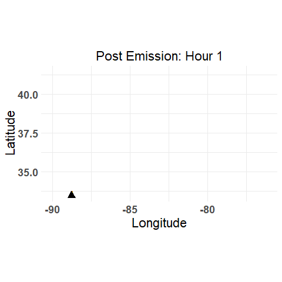

# EpiPlume

Exploratory models of pathogen movement via aerosol, particle, and airborne dispersion.

## Table of Contents:

1.  [Simple Gaussian Plume](https://github.com/JMHumphreys/EpiPlume/blob/main/docs/gaussian_plume.md): Model for Continuous emissions from a point source in a steady-state wind field, assuming Gaussian distribution of concentrations in the horizontal and vertical directions.\
2.  [Particle Trajectories]  
3.  [Dynamic Plume](https://github.com/JMHumphreys/EpiPlume/blob/main/docs/hysplit_plume.md): Simulated 36 hour particle plume dispersion.  

 
