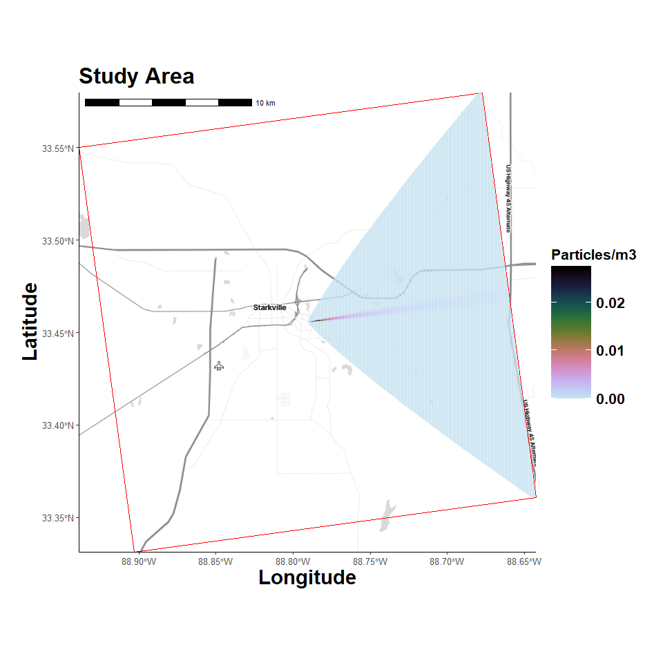

Gaussian Plume Model
================
4/13/25

- <a href="#libraries" id="toc-libraries">Libraries</a>
- <a href="#custom-functions" id="toc-custom-functions">Custom
  Functions</a>
- <a href="#create-study-area-grid" id="toc-create-study-area-grid">Create
  Study Area Grid</a>
- <a href="#location-map" id="toc-location-map">Location Map</a>
- <a href="#gaussian-plume" id="toc-gaussian-plume">Gaussian Plume</a>
- <a href="#plume-parameters" id="toc-plume-parameters">Plume
  Parameters</a>
- <a href="#pasquill-stability-classes"
  id="toc-pasquill-stability-classes">Pasquill Stability Classes</a>
- <a href="#create-plume-function" id="toc-create-plume-function">Create
  Plume Function</a>
- <a href="#apply-plume-function" id="toc-apply-plume-function">Apply
  Plume Function</a>
- <a href="#plot-results" id="toc-plot-results">Plot Results</a>

## Libraries

<details open>
<summary>Hide code</summary>

``` r
library(here)
library(tidyverse)
library(ggmap)
library(ggspatial)
library(sf)
library(terra)
```

</details>

## Custom Functions

<details open>
<summary>Hide code</summary>

``` r
source(here("R/utilities.R"))
source_dir(here("R"))
```

</details>

## Create Study Area Grid

Choosing an arbitrary geographic point. It will serve as the emission
point source location and be used to define study area extent.

<details open>
<summary>Hide code</summary>

``` r
center_coordinate <- c(-88.7904, 33.4555)  # Miss State Univ, center of study area
source_vect <- vect(matrix(center_coordinate, ncol = 2), type = "points", crs = "EPSG:4326")
timezone_utc <- get_timezone_utc(center_coordinate); timezone_utc
```

</details>

    Loading required package: lutz

    [1] "utc-05:00"

<details open>
<summary>Hide code</summary>

``` r
# desired projection
user_projection <- "+proj=utm +zone=18 +datum=WGS84 +units=m +no_defs"

# create grids
grid_raster <- create_spatraster_grid(center_coordinate, user_projection, extent_km = 25) # projected
grid_raster_geo <- create_spatraster_grid_geo(center_coordinate) # no proj version

# project source/center point
source_vect <- project(source_vect, user_projection)
```

</details>

## Location Map

Register Stadia Maps API to pull background images.

<details open>
<summary>Hide code</summary>

``` r
# register my API
map_api <- yaml::read_yaml(here("local", "secrets.yaml"))
register_stadiamaps(key = map_api$stadi_api)
```

</details>
<details open>
<summary>Hide code</summary>

``` r
map_plot <- map_grid(grid_raster)
```

</details>

    Loading required package: pals

    ℹ © Stadia Maps © Stamen Design © OpenMapTiles © OpenStreetMap contributors.

    Coordinate system already present. Adding new coordinate system, which will
    replace the existing one.

<details open>
<summary>Hide code</summary>

``` r
map_plot
```

</details>


## Gaussian Plume

The Gaussian plume model in by *estimate_gaussian_plume()* uses the
standard equation for continuous emissions from a point source in a
steady-state wind field, assuming Gaussian distribution of
concentrations in the horizontal and vertical directions.

**Math notation:**

$$ C(x, y, z) = \frac{Q}{2\pi u \sigma_y \sigma_z} \exp\left(-\frac{y^2}{2\sigma_y^2}\right) \left[ \exp\left(-\frac{(z - H)^2}{2\sigma_z^2}\right) + \exp\left(-\frac{(z + H)^2}{2\sigma_z^2}\right) \right] $$

**Where:**  
- $(C_{(x, y, z))}$ is the concentration at point $(x, y, z)$,  
- $Q$ is the emission rate (g/s),  
- $u$ is the wind speed (m/s),  
- $\sigma_y(x)$ and $\sigma_z(x)$ are the standard deviations of the
concentration distribution in the lateral and vertical directions,
respectively based on downwind distance x and atmospheric stability
class (see below),  
- $H$ is the effective stack height (m),  
- $x$ is the downwind distance,  
- $y$ is the crosswind distance,  
- $z$ is the height above ground.

The (y) and (z) bits correspond to `f_y` and `g1`, `g2` in
*estimate_gaussian_plume()*, see the [code
HERE](https://github.com/JMHumphreys/EpiPlume/blob/1b6859697f16ce61aa75c48ba26bf6686e9e00f2/R/estimate_gaussian_plume.R#L130-L132).

### Organize Data

Organizing location data to predict and visualize particle
concentrations across study area.

<details open>
<summary>Hide code</summary>

``` r
# source farm
source_coords <- crds(source_vect)

# cell coordinates
all_cells <- 1:ncell(grid_raster)
xy <- as.data.frame(xyFromCell(grid_raster, all_cells))

# relative coordinates with respect to source (assuming wind from west to east)
xy$x_rel <- xy$x - source_coords[1]
xy$y_rel <- xy$y - source_coords[2]

# assume all receptors are at 1.8 m height
receptors <- data.frame(x = xy$x_rel, y = xy$y_rel, z = rep(1.8, nrow(xy)))
```

</details>

## Plume Parameters

<details open>
<summary>Hide code</summary>

``` r
# poultry house dimensions 13m x 152 m = 1976 x 3m tall = 5928 m3
# average exhaust 3.10 m3/h
# PM_2.5 0.149 mg/m3

Q <- 100   # Emission rate (g/s)
H <- 10   # Source height (m)
u <- 3    # Wind speed (m/s)
```

</details>

## Pasquill Stability Classes

See, [NOAA page HERE](https://www.ready.noaa.gov/READYpgclass.php)

- A, B, and C are considered unstable conditions, with A being very
  unstable, producing high dispersion due to strong vertical mixing).  
- D represents neutral conditions—typically found under overcast skies
  or in urban areas where there is little convective activity.  
- E and F are stable conditions, with F being the most stable, with
  little vertical mixing (plume remains more confined).

## Create Plume Function

<details open>
<summary>Hide code</summary>

``` r
plume_model <- estimate_gaussian_plume(Q, H, u, sigma = stability_class("F"))
```

</details>

## Apply Plume Function

<details open>
<summary>Hide code</summary>

``` r
downwind_idx <- receptors$x > 0 # behind source (assuming wind W -> E)

# concentrations vector
concentrations <- numeric(nrow(receptors))
concentrations[!downwind_idx] <- 0
concentrations[downwind_idx] <- plume_model(receptors[downwind_idx, ])

# assign concentrations to grid
concentration_raster <- setValues(grid_raster, concentrations)
```

</details>

## Plot Results

Convert to dataframea. Setting zero concentrations to NA

<details open>
<summary>Hide code</summary>

``` r
df <- as.data.frame(concentration_raster, xy = TRUE)
df$grid[df$grid == 0] = NA

source_df <- data.frame(x = source_coords[,1], y = source_coords[,2])
```

</details>

Basic grid view

<details open>
<summary>Hide code</summary>

``` r
ggplot() +
  geom_raster(data = df, aes(x = x, y = y, fill = grid)) +
  scale_fill_gradientn(
    colors = rev(pals::cubehelix(30)[1:26]),
    na.value = "white",
    limits = c(0, max(df$grid, na.rm = TRUE)),
    name = "Concentration (g/m3)"
  ) +
  geom_point(data = source_df,
             aes(x = x, y = y),
             color = "blue", size = 3) +
  coord_equal() +
  labs(title = "Plume Dispersion",
       x = "Easting (m)",
       y = "Northing (m)") +
  theme_minimal()
```

</details>


Overlay on map

<details open>
<summary>Hide code</summary>

``` r
map_plot_plume <- map_grid(grid_raster, 
                           concentration_raster = concentration_raster, 
                           map_type = "stamen_toner_lite")
```

</details>

    ℹ © Stadia Maps © Stamen Design © OpenMapTiles © OpenStreetMap contributors.

    Coordinate system already present. Adding new coordinate system, which will
    replace the existing one.

<details open>
<summary>Hide code</summary>

``` r
map_plot_plume
```

</details>


