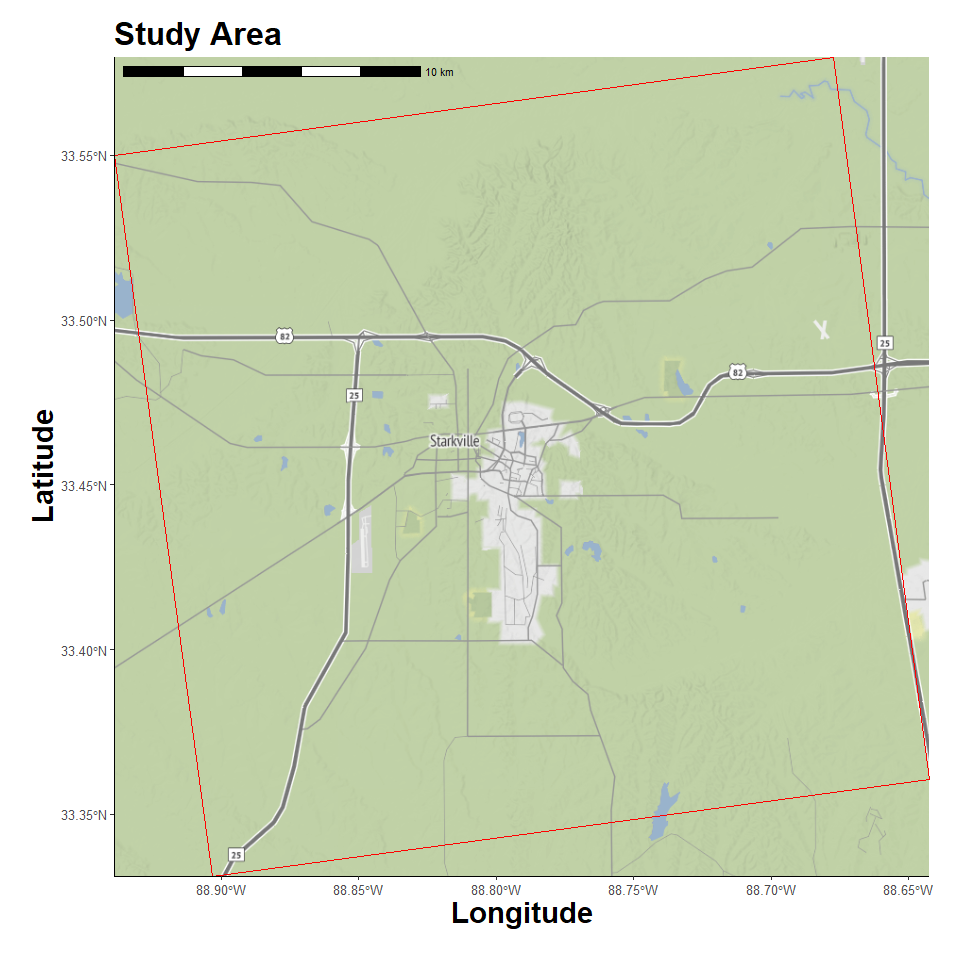
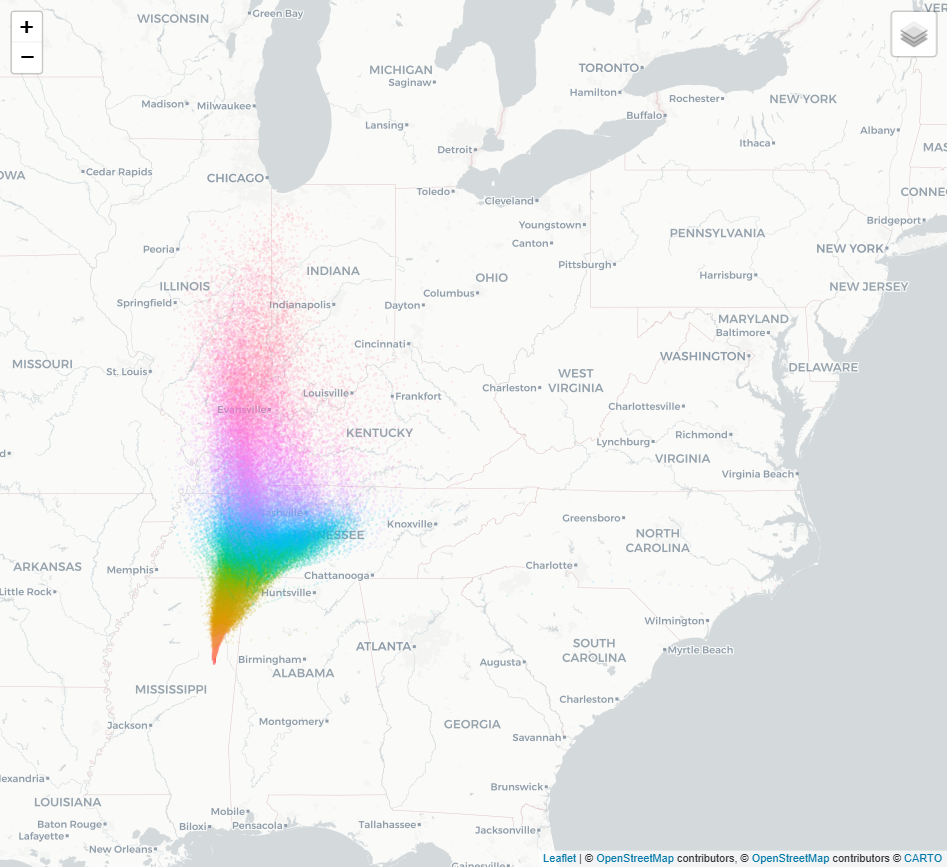
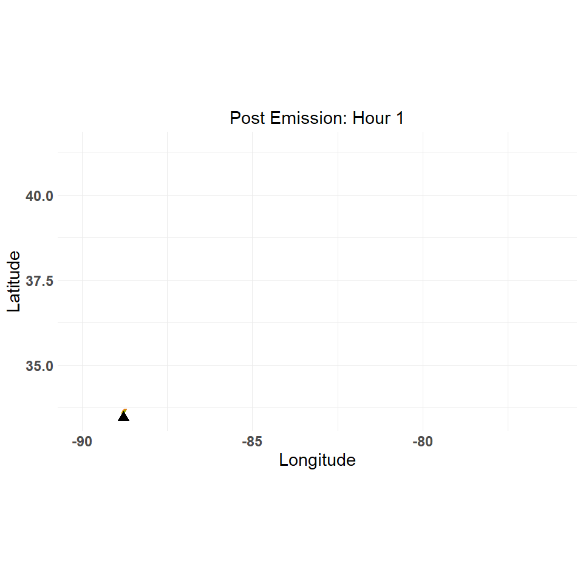

Plume Dispersian Model
================
4/13/25

- <a href="#libraries" id="toc-libraries">Libraries</a>
- <a href="#custom-functions" id="toc-custom-functions">Custom
  Functions</a>
- <a href="#timeout-duration" id="toc-timeout-duration">Timeout
  Duration</a>
- <a href="#create-study-area-grid" id="toc-create-study-area-grid">Create
  Study Area Grid</a>
- <a href="#location-map" id="toc-location-map">Location Map</a>
- <a href="#dispersion-model" id="toc-dispersion-model">Dispersion
  Model</a>
- <a href="#results-table" id="toc-results-table">Results Table</a>
- <a href="#plot-dispersion" id="toc-plot-dispersion">Plot Dispersion</a>

## Libraries

<details open>
<summary>Hide code</summary>

``` r
library(tidyverse)
library(here)
library(ggmap)
library(ggspatial)
library(sf)
library(terra)
library(gt)
library(pals)

library(splitr)
# devtools::install_github("rich-iannone/splitr")
```

</details>

## Custom Functions

<details open>
<summary>Hide code</summary>

``` r
source(here("R/utilities.R"))
source_dir(here("R"))
```

</details>

## Timeout Duration

To limit meteorological data download times.

<details open>
<summary>Hide code</summary>

``` r
getOption("timeout")
```

</details>

    [1] 60

<details open>
<summary>Hide code</summary>

``` r
options(timeout=10000)
```

</details>

## Create Study Area Grid

Choosing an arbitrary geographic point. It will serve as the emission
point source location and be used to define study area extent.

<details open>
<summary>Hide code</summary>

``` r
source_origin <- c(-88.7904, 33.4555)  # Miss State Univ
timezone_utc <- get_timezone_utc(source_origin)
```

</details>

    Loading required package: lutz

    Warning: package 'lutz' was built under R version 4.4.3

<details open>
<summary>Hide code</summary>

``` r
user_projection <- "+proj=utm +zone=18 +datum=WGS84 +units=m +no_defs"

grid_raster <- create_spatraster_grid(source_origin, user_projection) # projected
grid_raster_geo <- create_spatraster_grid_geo(source_origin) # no proj
```

</details>

## Location Map

Register Stadia Maps API to pull background images.

<details open>
<summary>Hide code</summary>

``` r
map_api <- yaml::read_yaml(here("local", "secrets.yaml"))
register_stadiamaps(key = map_api$stadi_api)
```

</details>

Vicinity around source.

<details open>
<summary>Hide code</summary>

``` r
map_plot <- map_grid(grid_raster)
```

</details>

    ℹ © Stadia Maps © Stamen Design © OpenMapTiles © OpenStreetMap contributors.

    Coordinate system already present. Adding new coordinate system, which will
    replace the existing one.

<details open>
<summary>Hide code</summary>

``` r
map_plot
```

</details>



## Dispersion Model

### Parameters

Pathogen half life estimation. Not clear that **splitR**is using this
parameter correctly… Could desired effect could be handled in post
processing. The *calculate_half_life()* assumes exponential decay.

<details open>
<summary>Hide code</summary>

``` r
virus_viability <- 3 # days until virus is non viable
viability_threshold <- 0.05 # this % maybe viable after the above virus_viability period
virus_hl <- calculate_half_life(virus_viability, viability_threshold)
virus_hl # daily reduction in virus viability
```

</details>

    [1] 0.6941346

### Initiate Model

<details open>
<summary>Hide code</summary>

``` r
dispersion_msu <- create_dispersion_model()
```

</details>

### Add Points Source

Setting the source details.

Estimating the input emission **rate** is contentious. A couple poultry
house PM tables here [Bist et al,
2022](https://www.mdpi.com/2076-3417/12/22/11323).

<details open>
<summary>Hide code</summary>

``` r
dispersion_msu <- dispersion_msu %>%
  add_source(
    name = "pathogen", 
    lon = source_origin[1],
    lat = source_origin[2],
    height = 5, # height above ground
    rate = 100, # particle emission rate
    pdiam = 2.5, # particle diameter, micrometers
    density = 1.5, # particle density in units of g/cm3
    shape_factor = 0.6, # shape/friction, 0-1 (smoothness, 1.0 is spherical)
    rad_decay = virus_hl, # pathogen viabaility
    release_start = ymd_hm("2020-02-16 10:00"),
    release_end = ymd_hm("2020-02-16 10:00") + hours(36)
  )
```

</details>

### Dispersion Parameters

<details open>
<summary>Hide code</summary>

``` r
dispersion_msu <- dispersion_msu %>%
  add_dispersion_params(
    start_time = ymd_hm("2020-02-16 10:00"),
    end_time = ymd_hm("2020-02-16 10:00") + hours(36), 
    direction = "forward", 
    #met_type = "gdas1",
    met_type = "nam12", # highest res in splitR
    met_dir = here("local/nam12"), # previously downloaded meteorological data
    exec_dir = here("local/nam12"), # outputs
    clean_up= FALSE
  ) 
```

</details>

### Run Model

This *run_model()* takes 3-5mins… Saving a local copy for later.

<details open>
<summary>Hide code</summary>

``` r
dispersion_msu <- dispersion_msu %>%
  run_model()

# save
saveRDS(dispersion_msu, here("local/nam12/dispersion_msu.rds"))
```

</details>
<details open>
<summary>Hide code</summary>

``` r
# load saved run
dispersion_msu <- readRDS(here("local/nam12/dispersion_msu.rds"))
class(dispersion_msu)
```

</details>

    [1] "dispersion_model"

## Results Table

The interesting outputs are recorded to a datatable in `model$disp_df`.

<details open>
<summary>Hide code</summary>

``` r
plume_table <- dispersion_msu$disp_df

dim(plume_table)
```

</details>

    [1] 89880     5

<details open>
<summary>Hide code</summary>

``` r
length(unique(plume_table$particle_i))
```

</details>

    [1] 2520

<details open>
<summary>Hide code</summary>

``` r
head(plume_table) # sample
```

</details>

    # A tibble: 6 × 5
      particle_i  hour   lat   lon height
      <chr>      <int> <dbl> <dbl>  <dbl>
    1 00001          1  33.6 -88.8    101
    2 00002          1  33.6 -88.8    235
    3 00003          1  33.6 -88.8    244
    4 00004          1  33.6 -88.8     34
    5 00005          1  33.6 -88.8     15
    6 00006          1  33.6 -88.8    293

## Plot Dispersion

The base **splitr** plot. Interactive when locally run.

<details open>
<summary>Hide code</summary>

``` r
# not run, too big
plot_dispersion(plume_table)
```

</details>



Custom static plot for quick viewing. Work in progress…

<details open>
<summary>Hide code</summary>

``` r
# not run, too big
plume_plot <- map_grid2(grid_raster, plume_table, group_col = "particle_i", vector_type = "point")
plume_plot
```

</details>

Animated plot.

<details open>
<summary>Hide code</summary>

``` r
# animated_plume <- animate_plume(grid_raster, plume_table, group_col = "particle_i")

animated_plume <- animate_plume_simple(plume_table, group_col = "particle_i", point_size = 0.5)
animated_plume
```

</details>



<details open>
<summary>Hide code</summary>

``` r
# save
anim_save(here("assets/plume_animation.gif"), animation = animated_plume)
```

</details>
