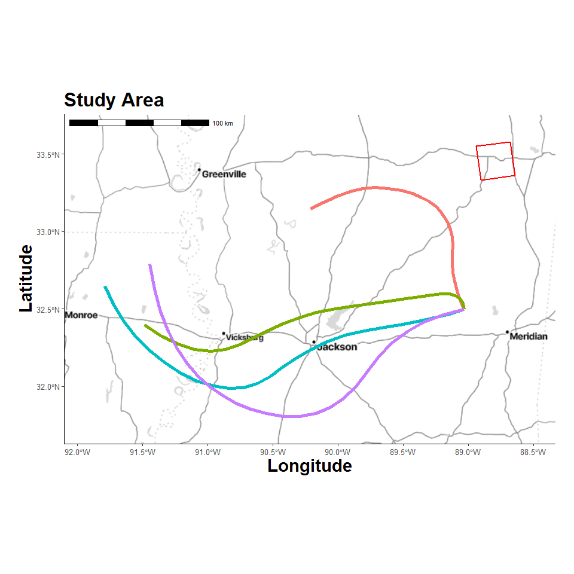

Dispersian Trajectories
================
4/13/25

- <a href="#libraries" id="toc-libraries">Libraries</a>
- <a href="#custom-functions" id="toc-custom-functions">Custom
  Functions</a>
- <a href="#timeout-duration" id="toc-timeout-duration">Timeout
  Duration</a>
- <a href="#create-study-area-grid" id="toc-create-study-area-grid">Create
  Study Area Grid</a>
- <a href="#location-map" id="toc-location-map">Location Map</a>
- <a href="#trajectory-model" id="toc-trajectory-model">Trajectory
  Model</a>
- <a href="#results-table" id="toc-results-table">Results Table</a>
- <a href="#plot-trajectories" id="toc-plot-trajectories">Plot
  Trajectories</a>

## Libraries

<details open>
<summary>Hide code</summary>

``` r
library(tidyverse)
library(here)
library(ggmap)
library(ggspatial)
library(sf)
library(terra)
library(gt)
library(pals)

library(splitr)
# devtools::install_github("rich-iannone/splitr")
```

</details>

## Custom Functions

<details open>
<summary>Hide code</summary>

``` r
source(here("R/utilities.R"))
source_dir(here("R"))
```

</details>

## Timeout Duration

To limit meteorological data download times.

<details open>
<summary>Hide code</summary>

``` r
getOption("timeout")
```

</details>

    [1] 60

<details open>
<summary>Hide code</summary>

``` r
options(timeout=10000)
```

</details>

## Create Study Area Grid

Choosing an arbitrary geographic point. It will serve as the emission
point source location and be used to define study area extent.

<details open>
<summary>Hide code</summary>

``` r
source_origin <- c(-88.7904, 33.4555)  # Miss State Univ
timezone_utc <- get_timezone_utc(source_origin)
```

</details>

    Loading required package: lutz

<details open>
<summary>Hide code</summary>

``` r
user_projection <- "+proj=utm +zone=18 +datum=WGS84 +units=m +no_defs"

grid_raster <- create_spatraster_grid(source_origin, user_projection) # projected
grid_raster_geo <- create_spatraster_grid_geo(source_origin) # no proj
```

</details>

## Location Map

Register Stadia Maps API to pull background images.

<details open>
<summary>Hide code</summary>

``` r
map_api <- yaml::read_yaml(here("local", "secrets.yaml"))
register_stadiamaps(key = map_api$stadi_api)
```

</details>

Vicinity around source.

<details open>
<summary>Hide code</summary>

``` r
map_plot <- map_grid(grid_raster)
```

</details>

    ℹ © Stadia Maps © Stamen Design © OpenMapTiles © OpenStreetMap contributors.

    Coordinate system already present. Adding new coordinate system, which will
    replace the existing one.

<details open>
<summary>Hide code</summary>

``` r
map_plot
```

</details>


## Trajectory Model

<details open>
<summary>Hide code</summary>

``` r
trajectory_model <-
  create_trajectory_model() %>%
  add_trajectory_params(
    traj_name= "traj_1",
    lon = source_origin[1], # long
    lat = source_origin[2], # lat
    height = 5, # height above ground (m)
    duration = 24,
    days = "2020-02-16",
    daily_hours = c(0, 6, 12, 18), # when to run sims
    model_height = 15000,
    direction = "forward",
    extended_met = TRUE,
    met_type = "nam12",
    met_dir = here("local/traj"),
    exec_dir = here("local/traj")
  ) %>%
  add_trajectory_params(
    traj_name= "traj_2",
    lon = source_origin[1], # long
    lat = source_origin[2], # lat
    height = 5, # height above ground (m)
    duration = 24,
    days = "2020-02-16",
    daily_hours = c(0, 6, 12, 18),
    model_height = 25000,
    direction = "forward",
    extended_met = TRUE,
    met_type = "nam12",
    met_dir = here("local/traj"), # inputs
    exec_dir = here("local/traj") # outputs
  ) %>%
  run_model()
```

</details>
<details open>
<summary>Hide code</summary>

``` r
# save
saveRDS(trajectory_model, here("local/nam12/trajectory_model.rds"))
```

</details>
<details open>
<summary>Hide code</summary>

``` r
# load saved run
trajectory_model <- readRDS(here("local/nam12/trajectory_model.rds"))
class(trajectory_model)
```

</details>

    [1] "trajectory_model"

## Results Table

The interesting outputs are recorded to a datatable in `model$traj_df`.

<details open>
<summary>Hide code</summary>

``` r
traj_out <- trajectory_model$traj_df

dim(traj_out) 
```

</details>

    [1] 100  21

<details open>
<summary>Hide code</summary>

``` r
names(traj_out)
```

</details>

     [1] "run"         "receptor"    "hour_along"  "traj_dt"     "lat"        
     [6] "lon"         "height"      "traj_dt_i"   "lat_i"       "lon_i"      
    [11] "height_i"    "pressure"    "theta"       "air_temp"    "rainfall"   
    [16] "mixdepth"    "rh"          "sp_humidity" "h2o_mixrate" "terr_msl"   
    [21] "sun_flux"   

<details open>
<summary>Hide code</summary>

``` r
head(traj_out)
```

</details>

    # A tibble: 6 × 21
        run receptor hour_along traj_dt               lat   lon height
      <int>    <int>      <int> <dttm>              <dbl> <dbl>  <dbl>
    1     1        1          0 2020-02-16 00:00:00  32.5 -89.0    5  
    2     1        1          1 2020-02-16 01:00:00  32.6 -89.1    4.4
    3     1        1          2 2020-02-16 02:00:00  32.6 -89.1    4.2
    4     1        1          3 2020-02-16 03:00:00  32.7 -89.1    4.3
    5     1        1          4 2020-02-16 04:00:00  32.7 -89.1    4.9
    6     1        1          5 2020-02-16 05:00:00  32.8 -89.1    5.9
    # ℹ 14 more variables: traj_dt_i <dttm>, lat_i <dbl>, lon_i <dbl>,
    #   height_i <dbl>, pressure <dbl>, theta <dbl>, air_temp <dbl>,
    #   rainfall <dbl>, mixdepth <dbl>, rh <dbl>, sp_humidity <dbl>,
    #   h2o_mixrate <dbl>, terr_msl <dbl>, sun_flux <dbl>

## Plot Trajectories

<details open>
<summary>Hide code</summary>

``` r
traj_plot <- map_grid2(grid_raster, traj_out, group_col = "run", vector_type = "line", line_size = 2)
traj_plot
```

</details>


