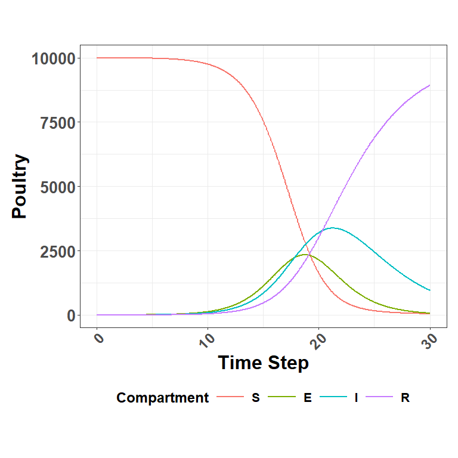
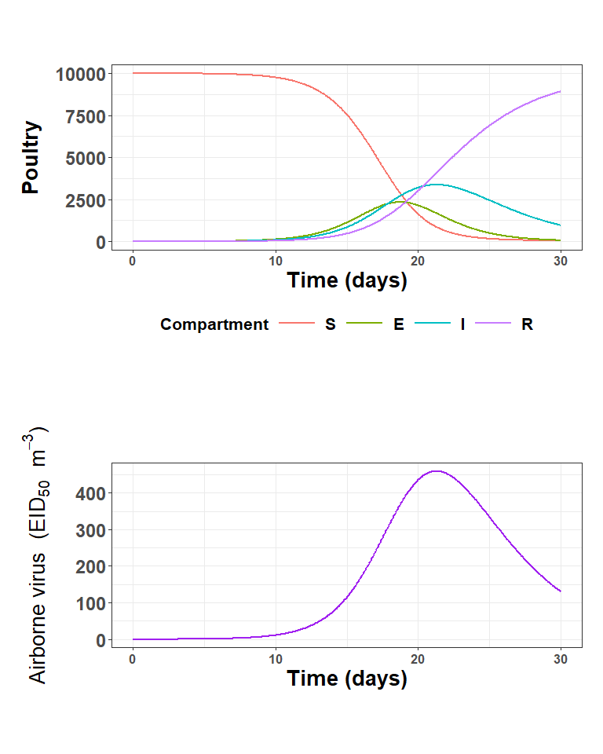
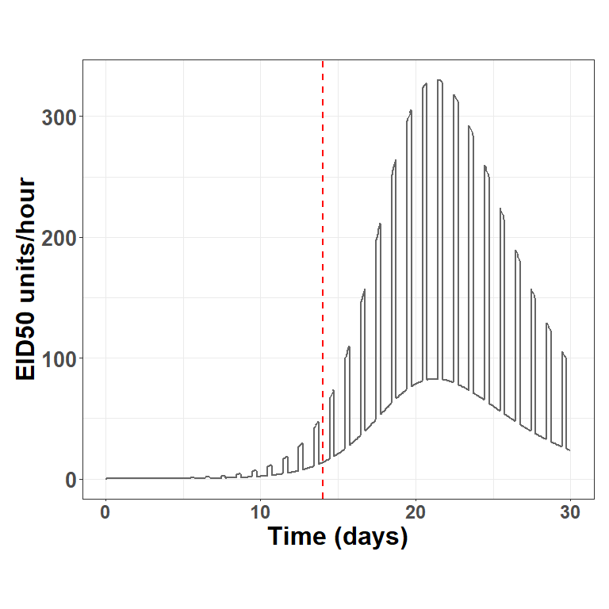

Poultry SEIR and Shedding
================
4/20/25

- <a href="#libraries" id="toc-libraries">Libraries</a>
- <a href="#custom-functions" id="toc-custom-functions">Custom
  Functions</a>
- <a href="#equation" id="toc-equation">Equation</a>
- <a href="#parameters" id="toc-parameters">Parameters</a>
- <a href="#initial-conditions" id="toc-initial-conditions">Initial
  Conditions</a>
- <a href="#run" id="toc-run">Run</a>
- <a href="#plot-dynamics" id="toc-plot-dynamics">Plot Dynamics</a>
- <a href="#virus-output" id="toc-virus-output">Virus Output</a>

## Libraries

<details open>
<summary>Hide code</summary>

``` r
library(tidyverse)
library(here)
library(patchwork)
library(deSolve)
```

</details>

## Custom Functions

<details open>
<summary>Hide code</summary>

``` r
source(here("R/utilities.R"))
source_dir(here("R"))
```

</details>

## Equation

<details open>
<summary>Hide code</summary>

``` r
SEIR_poultry <- function(t, state, parms){
  with(as.list(c(state, parms)),{
    
    N  <- S + E + I + R
    
    dS <- -beta * S * I / N
    dE <-  beta * S * I / N - sigma * E
    dI <-  sigma * E       - gamma * I
    dR <-  gamma * I                     
    
    list(c(dS, dE, dI, dR))
  })
}
```

</details>

## Parameters

see, Hayama et al. 2022)

<details open>
<summary>Hide code</summary>

``` r
parms <- c(
  beta  = 1.5, # range of 0.66–3.3
  sigma = 1/2, # latent period 2 day
  gamma = 1/4  # infectious period 4 day
)
```

</details>

## Initial Conditions

<details open>
<summary>Hide code</summary>

``` r
flock_size <- 10000
I0 <- 1
E0 <- 0
S0 <- flock_size - I0
R0 <- 0

state  <- c(S = S0, E = E0, I = I0, R = R0)

# timesteps
times  <- seq(0, 30, by = 1/24)   # hours
```

</details>

## Run

<details open>
<summary>Hide code</summary>

``` r
model_out <- as.data.frame(
  ode(y = state, times = times, func = SEIR_poultry, parms = parms)
)
```

</details>

## Plot Dynamics

<details open>
<summary>Hide code</summary>

``` r
plot_ode_dynamics(model_out)
```

</details>



## Virus Output

### Poultry House

<details open>
<summary>Hide code</summary>

``` r
calc_halflife <- calculate_half_life(3/24, 0.05)
calc_halflife
```

</details>

    [1] 0.02892228

<details open>
<summary>Hide code</summary>

``` r
flock_size <- 10000              # birds
house_vol  <- 1.9e4              # house volume, m3
Q_m3_h     <- 3e4                # hourly airflow/ventilation rate (30-120k)
Q_day      <- Q_m3_h * 24        # convert to m3 per day
t_half     <- calc_halflife      # virus  half‑life,  day
lambda_d   <- log(2) / t_half    # day
```

</details>

### Shedding

<details open>
<summary>Hide code</summary>

``` r
parms <- list(
  beta  = 1.5,                   # days
  sigma = 1/2,                   # latent 2 days
  gamma = 1/4,                   # infectious 4 dasy
  qV    = 1.6e5,                 # ball park EID50/ bird-day1
  Vh    = house_vol,
  Q     = Q_day,                 # m3 day
  lamd  = lambda_d               # days
)
```

</details>

### Initial Condition

<details open>
<summary>Hide code</summary>

``` r
state <- c(S = flock_size - 1, E = 0, I = 1, R = 0, V = 0)
```

</details>

### Modified SEIR

<details open>
<summary>Hide code</summary>

``` r
SEIR_poultry_shed <- function(t, y, p){
  with(as.list(c(y, p)),{
    N  <- S + E + I + R
    dS <- -beta * S * I / N
    dE <-  beta * S * I / N - sigma * E
    dI <-  sigma * E - gamma * I
    dR <-  gamma * I
    
    source <- qV * I
    dV <- (source / Vh) - (lamd + Q / Vh) * V
    
    list(c(dS,dE,dI,dR,dV))
  })
}
```

</details>

### Run

<details open>
<summary>Hide code</summary>

``` r
shed_out <- as.data.frame(
  ode(state, times, SEIR_poultry_shed, parms)
  )

# instantaneous concentration (not daily)
range(shed_out$V)
```

</details>

    [1]   0.0000 459.2442

### Plot Concentration

<details open>
<summary>Hide code</summary>

``` r
plot_ode_shed_dynamics(shed_out)
```

</details>



<details open>
<summary>Hide code</summary>

``` r
# diurnal variation
vent_profile <- function(t){
  h <- (t %% 1) * 24  # hour
  ifelse(h >= 10 & h < 18, 1.2e5, 3e4)  # high day, low night
}

eta <- 0.6   # loss factor(imperfect ventilation)

shed_out$Q <- vent_profile(shed_out$time) # m3 hour
shed_out$Emission <- eta * shed_out$Q * shed_out$V 

range(shed_out$Emission) # EID50
```

</details>

    [1]        0 33031226

<details open>
<summary>Hide code</summary>

``` r
EID50_scale <- 10^5 # 1 mass unit = 10e5 EID50 units
```

</details>
<details open>
<summary>Hide code</summary>

``` r
ggplot(shed_out, aes(time, Emission/EID50_scale)) +
    geom_line(linewidth = 1, col="gray40") +
    xlab("Time (days)") + 
    ylab("EID50 units/hour") +
    geom_vline(xintercept = 14, # ~time of detection
               linewidth=0.8,
               linetype="dashed",
               col="red") +
    theme_bw() +
    theme(plot.margin = unit(c(2,0.5,2,0.5),"cm"),
          legend.direction = "horizontal",
          legend.position="bottom", 
          strip.text = element_blank(), 
          strip.background = element_blank(),
          legend.key.size = unit(2,"line"),
          legend.key.width = unit(3,"line"),
          legend.text = element_text(size=16, face="bold"),
          legend.title = element_text(size=18, face="bold"),
          axis.title.x = element_text(size=24, face="bold"),
          axis.title.y = element_text(size=24, face="bold"),
          axis.text.x = element_text(face="bold", size=18),
          axis.text.y = element_text(size=20, face="bold"),
          plot.title = element_text(size=22, face="bold"))
```

</details>


