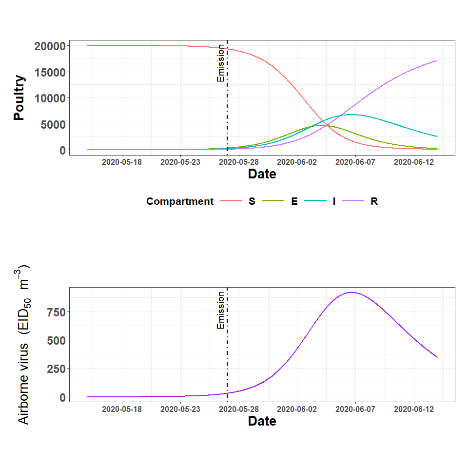
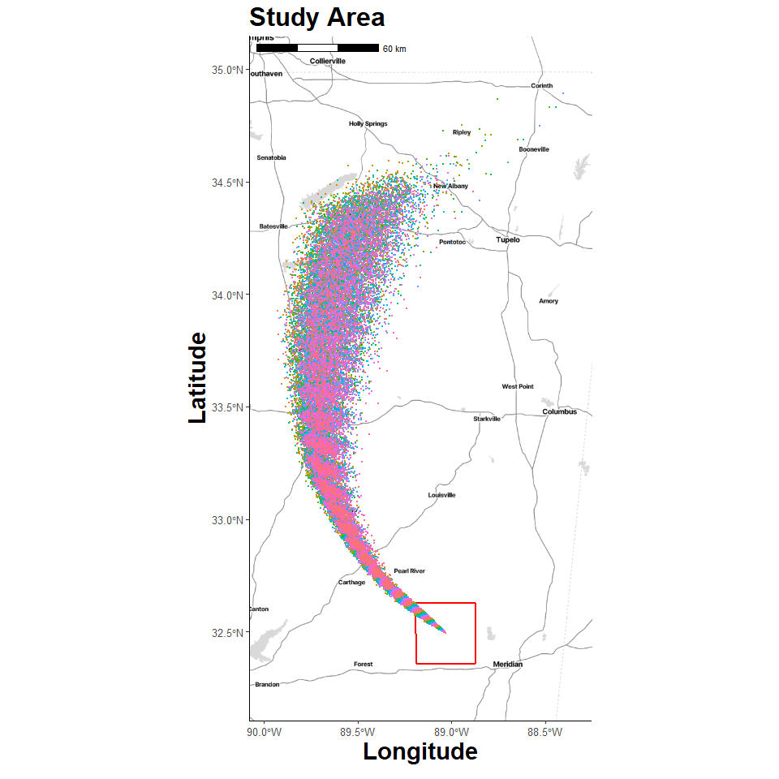
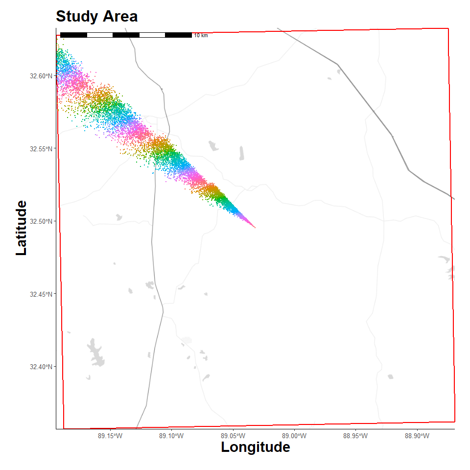
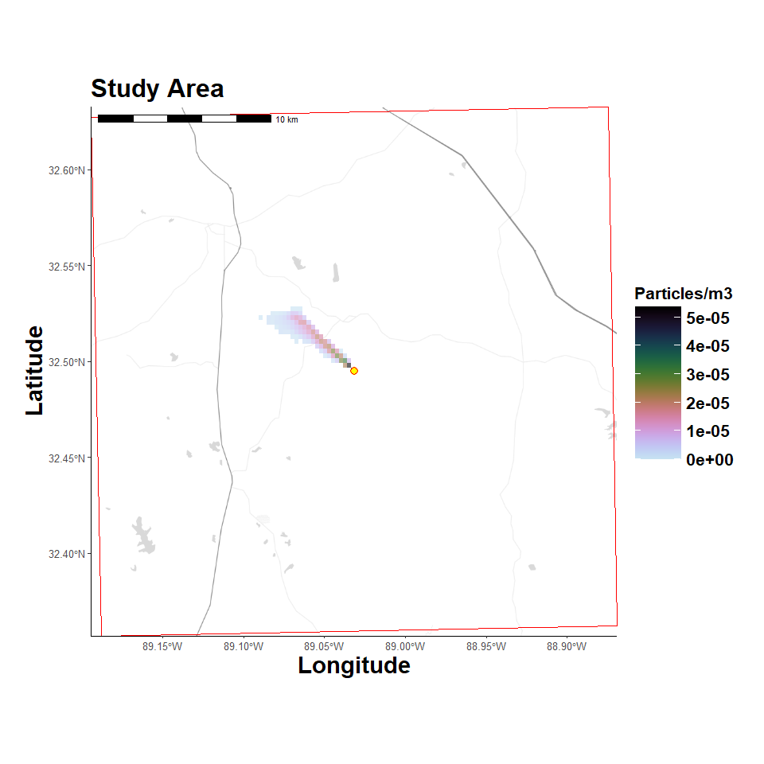
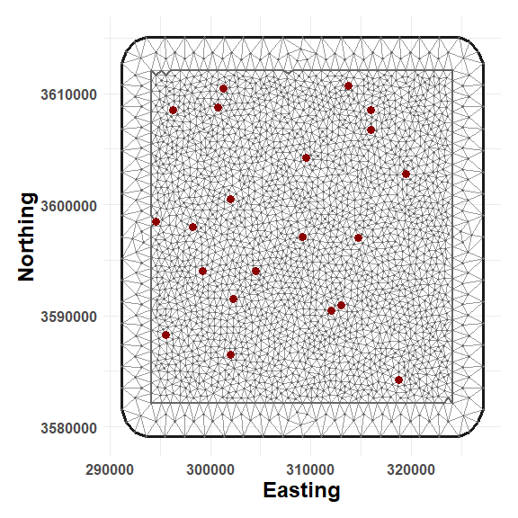
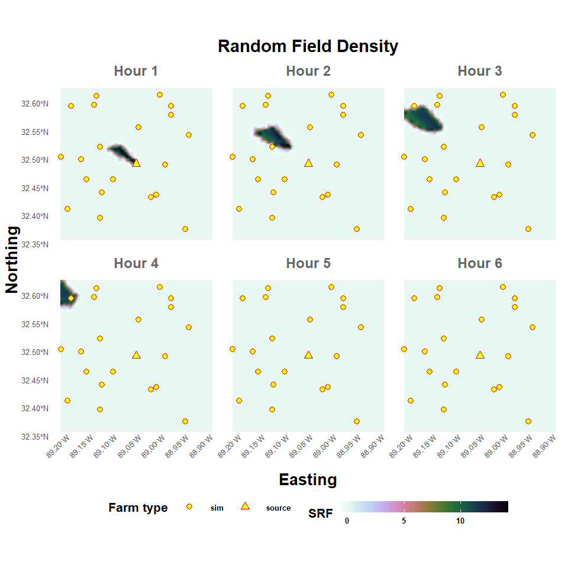
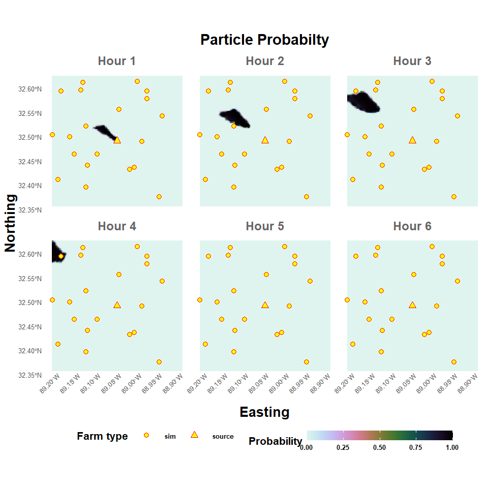
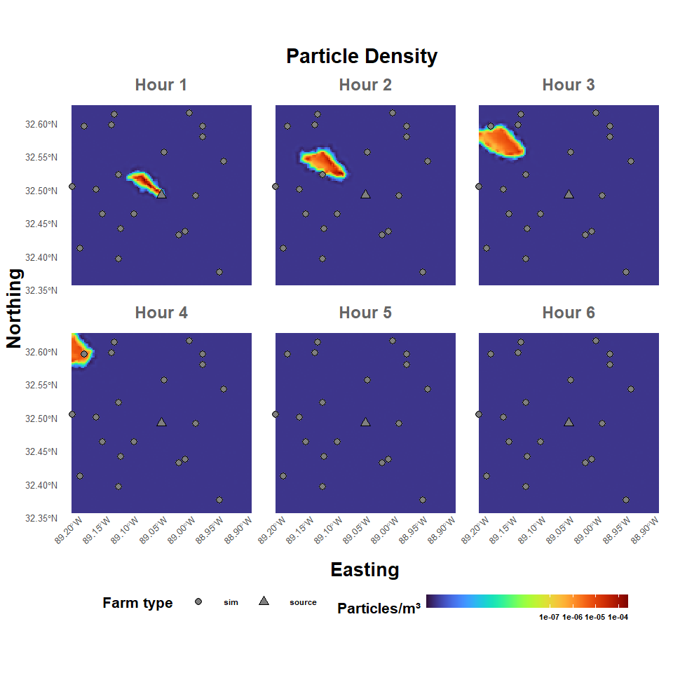
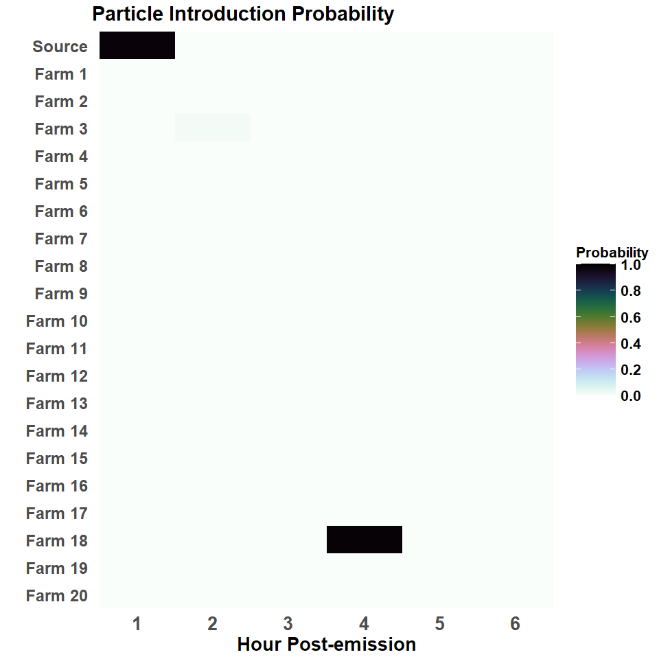

Simulate Airborne Virus Introduction and Outbreak
================
4/27/25

- <a href="#overview" id="toc-overview">Overview</a>
- <a href="#preliminary-setup" id="toc-preliminary-setup">Preliminary
  Setup</a>
- <a href="#read-configuration-parameters"
  id="toc-read-configuration-parameters">Read Configuration Parameters</a>
- <a href="#create-study-area" id="toc-create-study-area">Create Study
  Area</a>
- <a href="#simulate-outbreak" id="toc-simulate-outbreak">Simulate
  Outbreak</a>
- <a href="#plume-dispersion" id="toc-plume-dispersion">Plume
  Dispersion</a>
- <a href="#calculate-concentration"
  id="toc-calculate-concentration">Calculate Concentration</a>
- <a href="#spatiotemporal-modeling"
  id="toc-spatiotemporal-modeling">Spatiotemporal Modeling</a>
- <a href="#organize-data" id="toc-organize-data">Organize Data</a>
- <a href="#run-joint-spatiotemporal-model"
  id="toc-run-joint-spatiotemporal-model">Run Joint Spatiotemporal
  Model</a>
- <a href="#model-results" id="toc-model-results">Model Results</a>
- <a href="#farm-introduction-probability"
  id="toc-farm-introduction-probability">Farm Introduction Probability</a>
- <a href="#secondary-outbreak" id="toc-secondary-outbreak">Secondary
  Outbreak</a>
- <a href="#write-simulation-result"
  id="toc-write-simulation-result">Write Simulation Result</a>
- <a href="#closing" id="toc-closing">Closing</a>

## Overview

This script provides a conceptual workflow that simulates farm
locations, performes atmospheric dispersion modeling (aka, *plume*
modeling), analyizes the plume results in a spatial temporal model, and
identifies simulated farms most vulnerable to airborne virus
introduction.

## Preliminary Setup

### Libraries

This workflow uses the **renv** package for package versioning and
environmental management. The `renv.lock` file is included to facilitate
package installain. See, *renv::restore()*.

    ── Attaching core tidyverse packages ──────────────────────── tidyverse 2.0.0 ──
    ✔ dplyr     1.1.4     ✔ readr     2.1.5
    ✔ forcats   1.0.0     ✔ stringr   1.5.1
    ✔ ggplot2   3.5.2     ✔ tibble    3.2.1
    ✔ lubridate 1.9.4     ✔ tidyr     1.3.1
    ✔ purrr     1.0.4     
    ── Conflicts ────────────────────────────────────────── tidyverse_conflicts() ──
    ✖ dplyr::filter() masks stats::filter()
    ✖ dplyr::lag()    masks stats::lag()
    ℹ Use the conflicted package (<http://conflicted.r-lib.org/>) to force all conflicts to become errors
    here() starts at D:/Github/EpiPlume

    ℹ Google's Terms of Service: <https://mapsplatform.google.com>
      Stadia Maps' Terms of Service: <https://stadiamaps.com/terms-of-service>
      OpenStreetMap's Tile Usage Policy: <https://operations.osmfoundation.org/policies/tiles>
    ℹ Please cite ggmap if you use it! Use `citation("ggmap")` for details.
    Linking to GEOS 3.13.1, GDAL 3.10.2, PROJ 9.5.1; sf_use_s2() is TRUE

    terra 1.8.42


    Attaching package: 'terra'


    The following object is masked from 'package:ggmap':

        inset


    The following object is masked from 'package:gganimate':

        animate


    The following object is masked from 'package:patchwork':

        area


    The following object is masked from 'package:tidyr':

        extract


    Loading required package: sp


    Attaching package: 'raster'


    The following object is masked from 'package:dplyr':

        select


    Loading required package: Matrix


    Attaching package: 'Matrix'


    The following objects are masked from 'package:tidyr':

        expand, pack, unpack


    This is INLA_24.12.11 built 2024-12-11 19:58:26 UTC.
     - See www.r-inla.org/contact-us for how to get help.
     - List available models/likelihoods/etc with inla.list.models()
     - Use inla.doc(<NAME>) to access documentation


    Attaching package: 'splitr'


    The following object is masked from 'package:terra':

        add_grid

### Core Functions

Custom functions

<details open>
<summary>Hide code</summary>

``` r
source(here("R/utilities.R"))
source_dir(here("R"))
```

</details>

### Authentication

User credentials to access data repository and API resources.

<details open>
<summary>Hide code</summary>

``` r
authentications <- yaml::read_yaml(here("local", "secrets.yaml"))
```

</details>

### API Registration

**Stadia** maps are used for backgrounds.

<details open>
<summary>Hide code</summary>

``` r
register_stadiamaps(key = authentications$stadi_api)
```

</details>

### OSF Link

Models and data generated from this script are stored at the *Open
Science Framwork (OSF)* for remote access. See, this **OSF Project:**
https://osf.io/su4yz/

<details open>
<summary>Hide code</summary>

``` r
osf_auth(authentications$osf_token) # for write/admin privileges
```

</details>

    Registered PAT from the provided token

<details open>
<summary>Hide code</summary>

``` r
osf_project_demo <- osf_retrieve_node("https://osf.io/su4yz/")

osf_project_demo$name # scratch directory on OSF EpiPlume project
```

</details>

    [1] "Demonstration Data"

## Read Configuration Parameters

Parameters for epidemiological and spatial analyses are recorded in
configuration files. Loading the demonstration config file, whic can be
viewed here: [Demo Configuration
Parameters](https://github.com/geoepi/EpiPlume/blob/main/config/demo_2025-04-21.yaml).

<details open>
<summary>Hide code</summary>

``` r
cfg <- yaml::read_yaml(here("config", "demo_2025-04-21.yaml"))
```

</details>

## Create Study Area

From a given lat-long, the *define_study_domain()* function constructs a
surronding square grid at a specified extent and resolution to define a
study area. The function optionally generates a specified number of
simulated farms. The farms are randomly assigned within the study, based
on chicken density estimated in the Gridded Livestock of the World
Database
[(source)](https://www.fao.org/land-water/land/land-governance/land-resources-planning-toolbox/category/details/fr/c/1236449/).
The more chickens at a location, the higher the probability that a
random famr be placed there. The random farms are assigned a random
flock size based on a possible range specified in the config file.

<details open>
<summary>Hide code</summary>

``` r
study_area_args <- c(
  cfg$domain, # from config
  list(
    seed      = 123,
    min_flock = 15000,
    max_flock = 50000
  )
)

study_area <- exec(define_study_domain, !!!study_area_args)


# attributes
str(study_area)
```

</details>

    List of 4
     $ projection  : chr "+proj=utm +zone=16 +north +datum=WGS84 +units=m +no_defs"
     $ grid        :S4 class 'SpatRaster' [package "terra"]
     $ source_point:S4 class 'SpatVector' [package "terra"]
     $ farm_locs   :S4 class 'SpatVector' [package "terra"]

<details open>
<summary>Hide code</summary>

``` r
# flock sizes
range(study_area$farm_locs$flock)
```

</details>

    [1] 15861 49799

### flock size at source farm

For the demo, the centermost farm used in defining the study area is
considered the source of pathogen emission. The flock size is need for
that location to estimate emission.

<details open>
<summary>Hide code</summary>

``` r
source_flock_n <- values(study_area$farm_locs) %>%
  filter(farm == "source") %>%
  select(flock)

source_flock_n
```

</details>

      flock
    1 19998

### Plot Study Area

THe source is the centermost triangle, other farms are shown as circles.

<details open>
<summary>Hide code</summary>

``` r
map_grid(study_area$grid, source_loc = study_area$farm_locs)
```

</details>

<figure>

<figcaption aria-hidden="true">Figure 1: Study area for analysis with
simulated farms as indicated in legend.</figcaption>
</figure>

## Simulate Outbreak

### Dates

Random dates for initial infection and virus emission from the source
farm. Assuming detection occurs 5 to 20 days after outbreaks start. That
is, when workers notice that chicken death rates are exceeding the
normal background rate.

<details open>
<summary>Hide code</summary>

``` r
sim_dates <- random_infect_dates(year = 2020, month = 5, seed=1976)
sim_dates
```

</details>

    $release_date
    [1] "2020-05-27"

    $infection_date
    [1] "2020-05-15"

### SEIR and Emission Estimates

Run SEIR model for source farm. There are a ton of parameter assumptions
here to discuss. Brief explantions are provided with the [config file
(linked
here)](https://github.com/geoepi/EpiPlume/blob/main/config/demo_2025-04-21.yaml),
but far too much to include in this draft workfow.

<details open>
<summary>Hide code</summary>

``` r
# virus decay, rate of decreasing viability
halflife <- calculate_half_life(viability_days = cfg$virus$viability_hours/24, # convert hours to days
                                viability_threshold = cfg$virus$viability_threshold)

args <- list(
  beta       = cfg$seir$beta,
  sigma      = 1 / cfg$seir$sigma, # per/day
  gamma      = 1 / cfg$seir$gamma, # per/day
  qV         = cfg$virus$qV,
  Vh         = cfg$poultry$house_vol,
  Q          = cfg$poultry$Q_m3_h * 24, # to days
  lamd       = log(2) / halflife, # virus decay
  flock_size = source_flock_n$flock, # flock size at source farm
  Ei         = cfg$seir$Ei,
  Ii         = cfg$seir$Ii,
  Ri         = cfg$seir$Ri,
  Vi         = cfg$seir$Vi,
  sim_days   = cfg$seir$sim_days,
  infect_date = sim_dates$infection_date # initial infection
)

seir_out <- do.call(model_seir_shedding, args)
```

</details>

Get rate on day of emission

<details open>
<summary>Hide code</summary>

``` r
# values for emission day
source_rate <- seir_out %>%
  filter(datetime >= sim_dates$release_date & datetime < (sim_dates$release_date + days(1))) 

# range day of release
range(source_rate$V)
```

</details>

    [1] 30.43649 48.47731

### View SEIR Dynamics

Top panel is SEIR result, bottom is estimated virus output at the the
source farm.

<details open>
<summary>Hide code</summary>

``` r
plot_ode_shed_dynamics(seir_out, date_axis = TRUE, vline = sim_dates$release_date, vline_text = "Emission")
```

</details>



## Plume Dispersion

A [HYSPLIT](https://www.ready.noaa.gov/HYSPLIT.php) model is constructed
based on the simulated outbreak and source farm emission dynamics. The
[**splitR** package](https://github.com/rich-iannone/splitr) is used to
call a HYSPLIT exceutable from R.

<details open>
<summary>Hide code</summary>

``` r
arbitrary_hour <- 12 # noon
simulated_realease_dt <- ymd_hm(paste0(sim_dates$release_date, " ", sprintf("%02d:00", arbitrary_hour)))
```

</details>

### Run plume model

The *wrap_plume_model()* function saves the plume model locally,
however, a copy is also saved to OSF.

<details open>
<summary>Hide code</summary>

``` r
plume_model <- wrap_plume_model(cfg, # configuration file
                                plume_name = "sim_demo", # name/label
                                rate = mean(source_rate$V), # rate from simulated outbreak
                                release_start = simulated_realease_dt, # release from source farm
                                release_end = simulated_realease_dt + hours(1), # hour long
                                start_time = simulated_realease_dt, # dispersion time same as emission
                                end_time = simulated_realease_dt + hours(24) # dispersion end
                                )

# copy to OSF for others to access (~500kb)
osf_upload(osf_project_demo, path = here("local/demo_run/plume/sim_demo_model.rds"))
```

</details>

Download plume model from OSF

<details open>
<summary>Hide code</summary>

``` r
osf_id <- osf_project_demo %>%
  osf_ls_files() %>%
  filter(name == "sim_demo_model.rds")

osf_download(osf_id,
             path = here("local/temp"),
             conflicts = "overwrite")
```

</details>

Read plume model

<details open>
<summary>Hide code</summary>

``` r
plume_model <- readRDS(here("local/temp/sim_demo_model.rds"))
```

</details>

### View complete simulated dispersion

Full extent of plume

<details open>
<summary>Hide code</summary>

``` r
map_grid2(study_area$grid, plume_model$disp_df, group_col = "particle_i", vector_type = "point", grid_cut=FALSE)
```

</details>



Plume extent within study area

<details open>
<summary>Hide code</summary>

``` r
map_grid2(study_area$grid, plume_model$disp_df, group_col = "particle_i", vector_type = "point", grid_cut=TRUE)
```

</details>



A quick, low-weight animation as a spot check of time.

```

animate_disp <- animate_plume_simple(traj_data = plume_model$disp_df, 
                                     group_col = "particle_i", 
                                     point_size = 0.5, 
                                     source_loc=cfg$domain$source_origin)

animate_disp
```

## Calculate Concentration

The *calculate_particle_concentration()* utilizes HYSPLIT estimated
partcles to calculate the particles per m3 hour. Limiting analysis to
first 6 hours, beyond that time the plume is outside the study area.

<details open>
<summary>Hide code</summary>

``` r
concentration_lst <- calculate_particle_concentration(plume_table=plume_model$disp_df, 
                                                      raster_grid = study_area$grid,
                                                      voxel_height = 50, # height (m)
                                                      max_hour = 6) # maximum hour to use
```

</details>

### View Concentration

Viweing the first hour only.

<details open>
<summary>Hide code</summary>

``` r
check_hour <- 1

map_grid(study_area$grid, 
         source_loc = study_area$source_point, 
         concentration_raster = concentration_lst$concentration_stack[[check_hour]],
         map_type = "stamen_toner_lite")
```

</details>

    ℹ © Stadia Maps © Stamen Design © OpenMapTiles © OpenStreetMap contributors.

    Coordinate system already present. Adding new coordinate system, which will
    replace the existing one.



Get concentration estimates for later analysis.

<details open>
<summary>Hide code</summary>

``` r
concentration_df <- as.data.frame(concentration_lst$concentration_stack, xy = TRUE)

conc_melt <- reshape2::melt(concentration_df, c("x","y"))

conc_melt$hour <- as.integer(sub("^hour_", "", conc_melt$variable))

conc_melt <- conc_melt %>%
  mutate(hour = as.integer(sub("^hour_", "", variable)),
         concen = value) %>%
  select(-c(variable, value))
```

</details>

## Spatiotemporal Modeling

The primary objective of spatial modeling is to account for spatial
($s$) and temporal ($t$) latency (error, variability) and uncertainty in
HYSPLIT outputs. This *smoothed* results and enables uncertainty
estimation. Just as importantly, developing the the HYSPLIT outputs to a
spatiotemporal model allow for incorporating other variables, to include
climate, land cover, farm specific biosecurity factors, and genetic
samples to name a few.

The modeling framework here is a two-tiered joint model that
concurrently estimates particle counts (tier 1, ${y}_{1st}$) and mass
concentration (tier 2, ${y}_{2st}$) while accounting for correlated
spatial and temporal factors as well as their interaction. These
analyses follow a point-process framework, however concentration points
in ${y}_{2st}$ actually represent an area (grid cell). To help account
for errors created when aggregating particles to grid cells, the random
spatial field from the individual particles is shared with tier 2. In
essence, individual particles act as a *predictor* or *covariate* for
the cell-level concentration estimates.

As a joint model with two likelihoods, our response variable was
specified as a bivariate matrix (i.e., $Y = c({y}_{1st}, {y}_{2st})$
where the first column was coded to indicate particle occurrence (1) or
non-occurrence (0) such that,

$$
  \textit{y}_{1st} =
    \begin{cases}
      1, & \text{particle present} \\
      0, & \text{no particle present} \\ 
    \end{cases}       
$$

The second tier component modeled concentration where values were known,
with

$$
  \textit{y}_{2st} =
    \begin{cases}
      NA, & \text{concentration unknown} \\
      concentration, & \text{estimated concentration values}   
$$

To model airborne particulate matter using a **binomial-gamma joint
likelihood** was used to separately represent particle probability and
concentration. For particle detection ($y_1st$) was modeled using a
Bernoulli distribution, while the latent concentration of particulate
matter ($y_2st$) was modeled with a Gamma distribution:

$$
y_{1st} \sim \text{Bernoulli}(\pi_{st})
$$

$$
y_{2st} \sim \text{Gamma}(a_{st}, b_{st})
$$

where $\pi_{st}$ denotes the probability of detecting particulate matter
at spatial location $s$ and time $t$, and $a_{st}$ and $b_{st}$ are the
Gamma shape and rate parameters, with mean $\mu_{st} = a_{st} / b_{st}$.

The particle probability linear predictor was defined as:

$$
\text{logit}(\pi_{st}) = \alpha^1 + \zeta_{st}^1 + \lambda S_{st}
$$

The concentration linear predictor was defined as:

$$
\log(\mu_{st}) = \alpha^2 + \zeta_{st}^2 + \varphi_s^2 + \frac{1}{\lambda} S_{st}
$$

where:

- $\alpha^1$ and $\alpha^2$ are intercepts,
- $\zeta_{st}$ represents tier-specific spatial random effects,
- $S_{st}$ is a shared spatiotemporal effect,
- $\lambda$ is a scaling parameter linking the probability and
  concentration models.

### Construct mesh

Construct a tessellated mesh to define the study area

<details open>
<summary>Hide code</summary>

``` r
mesh.dom <- construct_mesh(
  grid_raster = study_area$grid,
  farm_locs = study_area$farm_locs)
```

</details>

Quick check

<details open>
<summary>Hide code</summary>

``` r
# mesh.dom$n # number of nodes

plot_mesh(mesh.dom)
```

</details>



### Combine data

Indexing all data to ensure all time steps (hours 1-6) are represented
and inserting NA where data is unknown.

<details open>
<summary>Hide code</summary>

``` r
comb_data_in <- replicate_data_timesteps(grid_raster = study_area$grid,
                                      farm_locs = study_area$farm_locs,
                                      concen_data = conc_melt,
                                      scale_concentration = 1e6,
                                      plume_model = plume_model,
                                      mesh = mesh.dom,
                                      max_hour = 6)
```

</details>

### Mesh projection

Aligning, matching, or *projecting* data to the mesh.

<details open>
<summary>Hide code</summary>

``` r
# flat prior based on study area width
width_m <- dim(study_area$grid)[1]*res(study_area$grid)[1]/3

sp_indices_dens <- project_to_mesh(comb_data = comb_data_in,
                                   prior.range=c(width_m, 0.01),
                                   prior.sigma=c(1, 0.01))
```

</details>

## Organize Data

Organizing all model inputs as *list()* objects. This is needed because
data within and between model tiers are different dimensions (i.e.,
won’t fit in a common dataframe).

### Individual particles

Organize tier 1 data for individual particles.

<details open>
<summary>Hide code</summary>

``` r
comb_data_in$set_type <- as.integer(
  as.factor(comb_data_in$set)
)

dens.lst <- list(c(sp_indices_dens$field.sp.1,
                 list(intercept1 = 1)), 
                 list(height = comb_data_in[,"height"],
                      hour_step.1 = comb_data_in[,"hour"],
                      hour_step.2 = comb_data_in[,"hour"],
                      hour_step.3 = comb_data_in[,"hour"],
                      set_type = comb_data_in[,"set_type"])
                )

comb_data_in$Yd <- ifelse(comb_data_in$set == "particle", 1, 
                      ifelse(comb_data_in$set == "node", 0, NA)
)

dens.stk <- inla.stack(data = list(Y = comb_data_in$Yd),
                                 A = list(sp_indices_dens$A.mat, 1), 
                           effects = dens.lst,   
                               tag = "dens.0")

j.dens.stk <- inla.stack(data = list(Y = cbind(comb_data_in$Yd, NA), link = 1),
                                 A = list(sp_indices_dens$A.mat, 1), 
                           effects = dens.lst,   
                               tag = "dens.0")
```

</details>

### Concentration

Organize tier 2 data for aggregate particle measures (concentration).

<details open>
<summary>Hide code</summary>

``` r
conc.lst <- list(c(sp_indices_dens$field.sp.2,
                 list(intercept2 = 1)), 
                 list(x = comb_data_in[,"x"],
                      hour_step.1 = comb_data_in[,"hour"],
                      hour_step.2 = comb_data_in[,"hour"],
                      hour_step.3 = comb_data_in[,"hour"])
                )

comb_data_in$concen[comb_data_in$concen == 0] <- 1e-6 # gamma distributed

concen.stk <- inla.stack(data = list(Y = comb_data_in$concen),
                                 A = list(sp_indices_dens$A.mat, 1), 
                           effects = conc.lst,   
                               tag = "conc.0")

j.conc.stk <- inla.stack(data = list(Y = cbind(NA, comb_data_in$concen), link = 2),
                                 A = list(sp_indices_dens$A.mat, 1), 
                           effects = conc.lst,   
                               tag = "conc.0")
```

</details>

### Combine Stacks

Combine the probability and and concentration data.

<details open>
<summary>Hide code</summary>

``` r
joint.stack <- inla.stack(j.dens.stk, j.conc.stk)
```

</details>

## Run Joint Spatiotemporal Model

The *run_joint_spatiotemporal()* is a wrapper function to facilitate
model fitting with [r-INLA](https://www.r-inla.org/). The model formula
and execution can be viewed here: [**Model
Details**](https://github.com/geoepi/EpiPlume/blob/main/R/run_joint_spatiotemporal.R)

<details open>
<summary>Hide code</summary>

``` r
bin_gamma_model <- run_joint_spatiotemporal(field.sp.1 = sp_indices_dens$field.sp.1,
                                            field.sp.2 = sp_indices_dens$field.sp.2,
                                            spde_prior = sp_indices_dens$spde0,
                                            est.stk = joint.stack,
                                            verbose =TRUE)

# copy to OSF for others to access (~112mb)
osf_upload(osf_project_demo, path = here("local/assets/bg_model_2025-04-26.rds"))
```

</details>

Download pre-run from OSF

<details open>
<summary>Hide code</summary>

``` r
osf_id <- osf_project_demo %>%
  osf_ls_files() %>%
  filter(name == "bg_model_2025-04-26.rds")

osf_download(osf_id,
             path = here("local/temp"),
             conflicts = "overwrite")
```

</details>

Read spatiotemporal model

<details open>
<summary>Hide code</summary>

``` r
bin_gamma_model <- readRDS("local/temp/bg_model_2025-04-26.rds")
```

</details>

## Model Results

Inspecting a few spatiotemporal model outputs.

### Get Latent Fields

The *get_spatial_rf()* function spatial

<details open>
<summary>Hide code</summary>

``` r
random_latent_field <- get_spatial_rf(model = bin_gamma_model,
                                      field_sp = sp_indices_dens$field.sp.1,
                                      raster_template = study_area$grid,
                                      mesh = mesh.dom
)
```

</details>

### View Fields

<details open>
<summary>Hide code</summary>

``` r
plot_latent_stack(rast_stack=random_latent_field,
                  farm_locs = study_area$farm_locs)
```

</details>



### Particle Probabilty

Extracting the probability estimates for all locations in the study
area.

<details open>
<summary>Hide code</summary>

``` r
particle_probs <- extract_stmodel_estimates(model = bin_gamma_model,
                                            stack = joint.stack,
                                            stack_targ = "dens.0",
                                            match_data = comb_data_in,
                                            grid_label = "concen",
                                            raster_template = study_area$grid)
```

</details>
<details open>
<summary>Hide code</summary>

``` r
plot_prob_stack(particle_probs)
```

</details>



### Particle Concentration

Extracting estimated concentrations for all locations in the study area.

<details open>
<summary>Hide code</summary>

``` r
particle_conc <- extract_stmodel_estimates(model = bin_gamma_model,
                                            stack = joint.stack,
                                            stack_targ = "conc.0",
                                            match_data = comb_data_in,
                                            grid_label = "concen",
                                            raster_template = study_area$grid)
```

</details>
<details open>
<summary>Hide code</summary>

``` r
plot_conc_stack(particle_conc)
```

</details>



Optionally, can convert particle density to mass concentration (g/m3)
using *convert_particle_to_mass_concentration()*.

<details open>
<summary>Hide code</summary>

``` r
mass_conc_stack <- particle_conc

values(mass_conc_stack) <- convert_particle_to_mass_concentration(concentration_particles_m3 = values(mass_conc_stack),
                                                                  pdiam_um = cfg$plume$pdiam,
                                                                  density_g_cm3 = cfg$plume$density,
                                                                  shape_factor = cfg$plume$shape_factor,
                                                                  output_units = "g/m3")
```

</details>

## Farm Introduction Probability

Comparing particle probability estimates for simulated farm locations.

<details open>
<summary>Hide code</summary>

``` r
farm_intro_probs <- extract_farm_estimates(model = bin_gamma_model,
                                           stack = joint.stack,
                                           stack_targ = "dens.0",
                                           match_data = comb_data_in)
```

</details>

### Probability at farms

<details open>
<summary>Hide code</summary>

``` r
farm_intro_probs$plot
```

</details>



Filtering to simulated farms with at least a 50/% chance of particle
occurrence.

<details open>
<summary>Hide code</summary>

``` r
exposed_farms <- farm_intro_probs$table %>%
  filter(med >= 0.5 & name != "source_farm") # 50% chnace or higher

exposed_farms
```

</details>

         name   label    low    med   high flock
    1 farm_18 Farm 18 0.9823 0.9854 0.9868 22574

## Secondary Outbreak

Given the high probability of particle introduction at a farm another
than the *source_farm*, approximate how an outbreak might unfold based
on that farm’s flock size, timeline of introdtcon, and other
charcateristics.

### SEIR model for secondary ourbreak

<details open>
<summary>Hide code</summary>

``` r
infect_date <- as_date(simulated_realease_dt)

intro_farm_args <- list(
  beta       = cfg$seir$beta,
  sigma      = 1 / cfg$seir$sigma,
  gamma      = 1 / cfg$seir$gamma,
  qV         = cfg$virus$qV,
  Vh         = cfg$poultry$house_vol,
  Q          = cfg$poultry$Q_m3_h * 24,
  lamd       = log(2) / halflife,
  flock_size = exposed_farms$flock, # flock size where virus introduced
  Ei         = cfg$seir$Ei,
  Ii         = cfg$seir$Ii,
  Ri         = cfg$seir$Ri,
  Vi         = cfg$seir$Vi,
  sim_days   = cfg$seir$sim_days,
  infect_date = infect_date # infection same day as emission (only hours difference)
)

seir_exposed_farm <- do.call(model_seir_shedding, intro_farm_args)
```

</details>

Outbreak at exposed farm. For `rand_detect_day`, assuming detection
occurs 5 to 20 days after outbreaks start. That is, when workers notice
that death rates are exceeding the normal background rate.

<details open>
<summary>Hide code</summary>

``` r
set.seed(1976)
rand_detect_day <- round(runif(1, 5, 20),0)
detection_date <- infect_date + days(rand_detect_day)
```

</details>

### View outbreak dynamics

<details open>
<summary>Hide code</summary>

``` r
plot_ode_shed_dynamics(seir_exposed_farm, date_axis = TRUE, vline = detection_date, vline_text = "Detection")
```

</details>


## Write Simulation Result

Recording outbreak simulation info to be used in downstream analysis.

<details open>
<summary>Hide code</summary>

``` r
farms_wgs84 <- project(study_area$farm_locs, "EPSG:4326") # long/lat

simulation_keep <- as.data.frame(farms_wgs84, geom="xy") %>%
  mutate(outbreak = if_else(name == exposed_farms$name, detection_date,
         if_else(name == "source_farm", sim_dates$release_date, NA)))
```

</details>

Write copies locally and on OSF

<details open>
<summary>Hide code</summary>

``` r
# local copy
write.csv(simulation_keep, here("local/assets/demo_outbreak_sim_2025-04-28.csv"))

# copy to OSF for others to access
osf_upload(osf_project_demo, path = here("local/assets/demo_outbreak_sim_2025-04-28.csv"))
```

</details>

## Closing

This script simualted a pathogen plume from a source farm location
followed secondary outbreaks at other farms downwind. Next, the results
here are analysed in the script HERE to determine if that outbreak can
be traced back to the orginal source farm. \`\`\`
