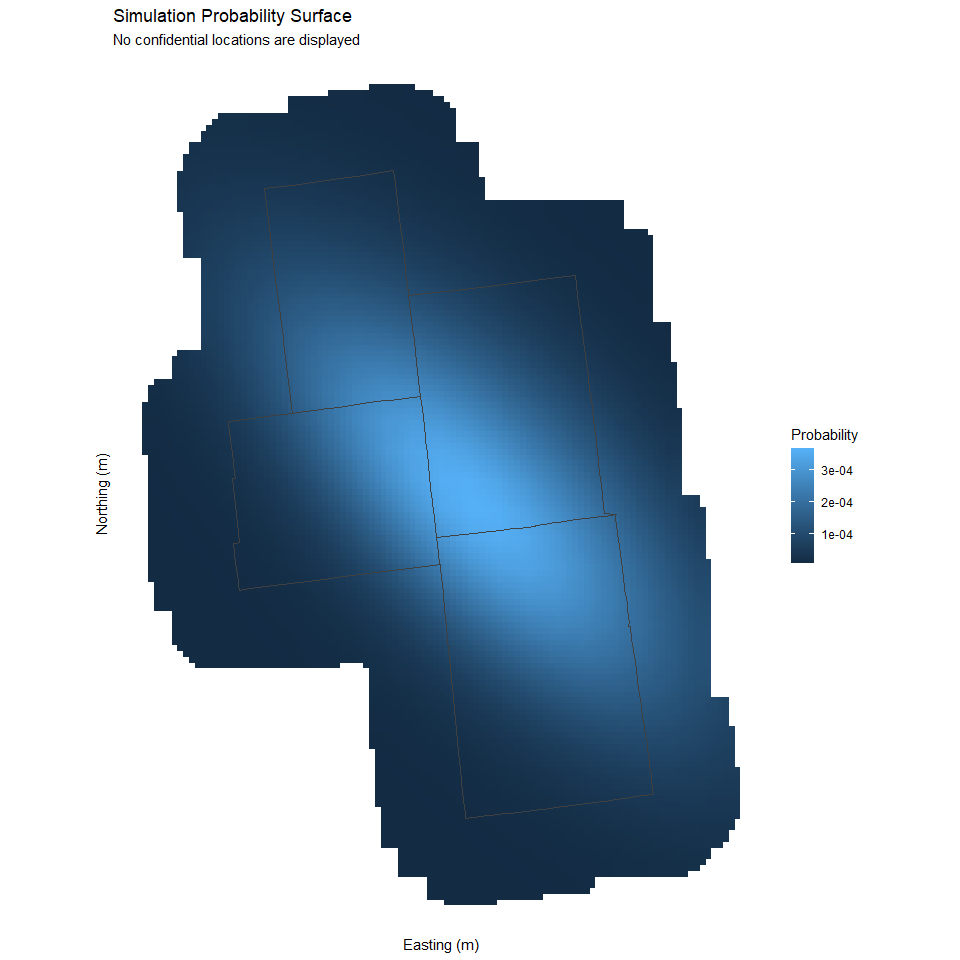
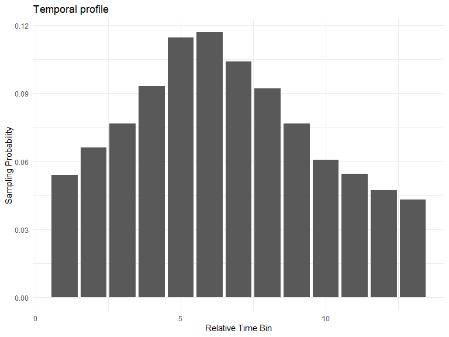
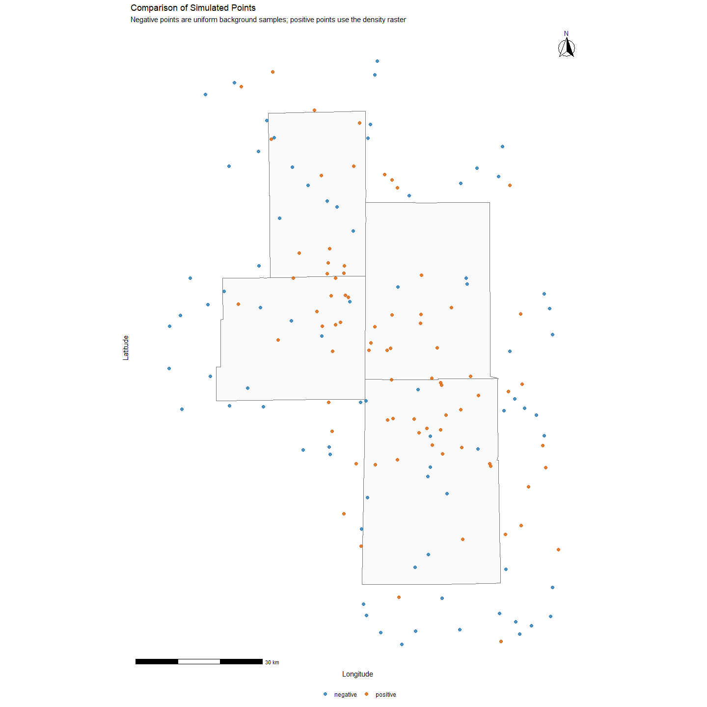
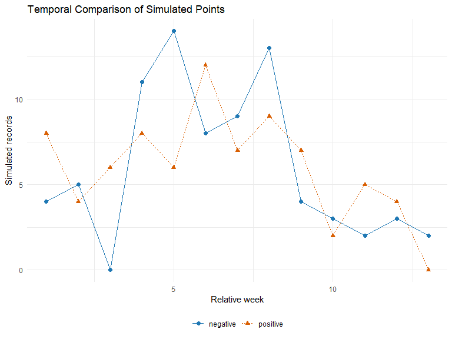
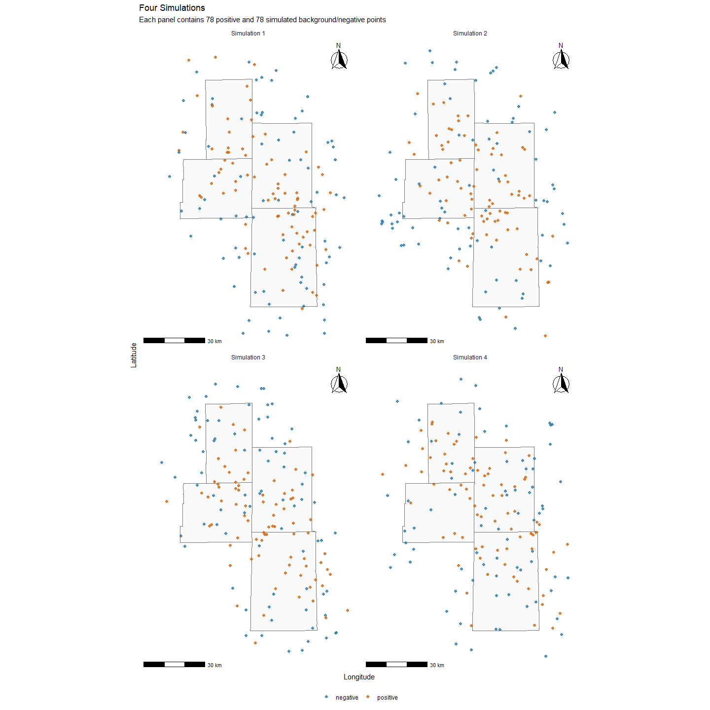

Simulate Points
================
8/26/26

- <a href="#overview" id="toc-overview">Overview</a>
- <a href="#libraries" id="toc-libraries">Libraries</a>
- <a href="#configuration" id="toc-configuration">Configuration</a>
- <a href="#read-truth" id="toc-read-truth">Read Truth</a>
- <a href="#county-boundaries" id="toc-county-boundaries">County
  Boundaries</a>
- <a href="#estimate-spatial-orientation"
  id="toc-estimate-spatial-orientation">Estimate Spatial Orientation</a>
- <a href="#simulation-grid" id="toc-simulation-grid">Simulation Grid</a>
- <a href="#rasterize-truth-locations"
  id="toc-rasterize-truth-locations">Rasterize Truth Locations</a>
- <a href="#estimate-positive-event-density"
  id="toc-estimate-positive-event-density">Estimate Positive-event
  Density</a>
- <a href="#mix-density-with-uniform-probability"
  id="toc-mix-density-with-uniform-probability">Mix Density with Uniform
  Probability</a>
- <a href="#create-1-km-rasters" id="toc-create-1-km-rasters">Create 1-km
  Rasters</a>
- <a href="#construct-temporal-profile"
  id="toc-construct-temporal-profile">Construct Temporal Profile</a>
- <a href="#write-simulation-inputs"
  id="toc-write-simulation-inputs">Write Simulation Inputs</a>
- <a href="#simulation-function" id="toc-simulation-function">Simulation
  Function</a>
- <a href="#demonstrate-paired-simulation"
  id="toc-demonstrate-paired-simulation">Demonstrate Paired Simulation</a>
- <a href="#generate-four-independent-simulations"
  id="toc-generate-four-independent-simulations">Generate Four Independent
  Simulations</a>
- <a href="#view-result" id="toc-view-result">View Result</a>
- <a href="#save-the-simulated-data" id="toc-save-the-simulated-data">Save
  the Simulated Data</a>
- <a href="#shareable-files-summary"
  id="toc-shareable-files-summary">Shareable Files Summary</a>

## Overview

This script uses a confidential set of dated point locations to inform a
generalized spatial simulation. The original locations are never plotted
or exported. Spatial information is generalized through coarse-grid
rasterization, anisotropic Gaussian smoothing, nonlinear compression,
and mixing with a modest uniform spatial component.

The resulting shareable products are:

- `simulation_domain.tif`: the geographic surface for uniform background
  (“negative”) sampling;
- `simulation_density.tif`: the generalized probability surface for
  positive sampling;
- `simulation_temporal_profile.csv`: a generalized relative temporal
  profile to align event frequency to a date range;
- `simulate_points.R`: the standalone simulation function and helper
  functions; and
- `simulated_points_four_replicates.csv`: four independent
  positive/background paired simulations used in the final figure.

Here, “negative” denotes a simulated background or pseudo-absence
location, not a confirmed absence.

## Libraries

<details open>
<summary>Hide code</summary>

``` r
library(tidyverse)
library(here)
library(sf)
library(terra)
library(ggplot2)
library(ggspatial)
library(tigris)
```

</details>

## Configuration

The confidential source file is read only during construction of the
generalized inputs. Set `SIM_TRUTH_PATH` in the local environment when
rendering on another machine.

<details open>
<summary>Hide code</summary>

``` r
truth_path <- Sys.getenv(
  "SIM_TRUTH_PATH",
  unset = "D:/HPAI_Data/HPAI/HPAI/Cleaned Data/locations.csv"
)

share_dir <- here("assets", "simulation_share")
dir.create(share_dir, recursive = TRUE, showWarnings = FALSE)

# Spatial smoothing
project_crs <- 5070                    # NAD83 / Conus Albers; meters
construction_resolution_m <- 5000     # confidential data are rasterized at 5 km
output_resolution_m <- 1000           # shared simulation rasters are 1 km
county_domain_buffer_m <- 15000        # allow simulation up to 15 km beyond the four-county union
plot_buffer_m <- 5000                  # additional map margin outside the simulation domain
smoothing_sigma_long_m <- 30000        # smoothing along the dominant NW-SE axis
smoothing_sigma_short_m <- 10000       # smoothing across the dominant axis
density_power <- 0.99                  # compression; <0.5 reduces spatial clustering
spatial_uniform_mix <- 0.10            # increase uniformity
orientation_round_deg <- 15            # generalize PCA orientation to nearest 15 degrees

# time smoothing
temporal_uniform_mix <- 0.25

# Sites sto produce
n_positive <- 78
n_negative <- 78
demo_date_range <- as.Date(c("2024-12-22", "2025-03-16"))

# mapping colors 
class_palette <- c(negative = "#1f78b4", positive = "#d95f02")
```

</details>

## Read Truth

Protected data. No coordinates from `locs` are printed, plotted, or
exported.

<details open>
<summary>Hide code</summary>

``` r
locs <- read_csv(truth_path, show_col_types = FALSE) |>
  mutate(date = as.Date(date))

required_cols <- c("date", "lat", "lon")
if (!all(required_cols %in% names(locs))) {
  stop("Input must contain date, lat, and lon columns.")
}

if (anyNA(locs[, required_cols])) {
  stop("Input contains missing values.")
}

locs_sf <- st_as_sf(
  locs,
  coords = c("lon", "lat"),
  crs = 4326,
  remove = FALSE
)

# project
locs_proj <- st_transform(locs_sf, project_crs)
```

</details>

The truth source data contain 78 records spanning 2024-12-22 through
2025-03-16.

## County Boundaries

The simulation domain is the union of the intersecting counties plus a
15-km buffer. This permits some synthetic observations to fall just
outside the four counties.

<details open>
<summary>Hide code</summary>

``` r
options(tigris_use_cache = TRUE)

counties_public <- map_dfr(
  c("IN", "OH"),
  ~ tigris::counties(state = .x, cb = TRUE, year = 2024, class = "sf")
) |>
  st_transform(project_crs)

truth_union <- st_union(st_geometry(locs_proj))

counties_context <- counties_public[
  lengths(st_intersects(counties_public, truth_union)) > 0,
]

county_union <- st_union(counties_context)
domain <- st_buffer(county_union, county_domain_buffer_m)
domain_v <- vect(domain)

# ensure plot extent includes full simulation
plot_region <- st_buffer(domain, plot_buffer_m)
plot_region_ll <- st_transform(plot_region, 4326)
plot_bbox_ll <- st_bbox(plot_region_ll)
plot_xlim <- c(unname(plot_bbox_ll["xmin"]), unname(plot_bbox_ll["xmax"]))
plot_ylim <- c(unname(plot_bbox_ll["ymin"]), unname(plot_bbox_ll["ymax"]))

counties_ll <- st_transform(counties_context, 4326)
```

</details>

## Estimate Spatial Orientation

The generalized density should retain broad directional structure
without preserving individual hotspots. A PCA is used to estimate the
dominant axis of the confidential coordinates.

<details open>
<summary>Hide code</summary>

``` r
xy_truth <- st_coordinates(locs_proj)
pc <- prcomp(xy_truth, center = TRUE, scale. = FALSE)

major_axis <- pc$rotation[, 1]
theta_raw_rad <- atan2(major_axis[2], major_axis[1])
theta_raw_deg <- theta_raw_rad * 180 / pi

theta_generalized_deg <-
  round(theta_raw_deg / orientation_round_deg) * orientation_round_deg

theta_generalized_rad <- theta_generalized_deg * pi / 180
```

</details>

The smoothing kernel has a larger standard deviation along the axis than
across it, i.e., creates broad NW-SE corridor.

## Simulation Grid

The true observations are first aggrgated to 5-km grid. This grid is
used temporarily and is not shared.

<details open>
<summary>Hide code</summary>

``` r
construction_template <- rast(
  ext(domain_v),
  resolution = construction_resolution_m,
  crs = crs(domain_v)
)

construction_domain <- rasterize(
  domain_v,
  construction_template,
  field = 1,
  background = NA
)

construction_domain
```

</details>

    class       : SpatRaster 
    dimensions  : 28, 21, 1  (nrow, ncol, nlyr)
    resolution  : 4926.09, 5070.169  (x, y)
    extent      : 889656.6, 993104.4, 1918394, 2060359  (xmin, xmax, ymin, ymax)
    coord. ref. : NAD83 / Conus Albers (EPSG:5070) 
    source(s)   : memory
    name        : layer 
    min value   :     1 
    max value   :     1 

## Rasterize Truth Locations

The raw count raster is not shared or exported.

<details open>
<summary>Hide code</summary>

``` r
pts_v <- vect(locs_proj)

counts <- rasterize(
  pts_v,
  construction_domain,
  fun = "sum",
  background = 0
)

counts <- mask(counts, construction_domain)
```

</details>

## Estimate Positive-event Density

An anisotropic Gaussian kernel is used. The long axis follows the
generalized PCA orientation, while the short axis limits smoothing
perpendicular to that corridor.

<details open>
<summary>Hide code</summary>

``` r
counts0 <- ifel(is.na(counts), 0, counts)

make_anisotropic_kernel <- function(
    raster,
    sigma_long_m,
    sigma_short_m,
    theta_rad,
    truncate = 3
) {
  cell_size <- mean(res(raster))
  radius_cells <- ceiling(
    truncate * max(sigma_long_m, sigma_short_m) / cell_size
  )

  offsets <- (-radius_cells:radius_cells) * cell_size

  x <- matrix(
    rep(offsets, each = length(offsets)),
    nrow = length(offsets),
    ncol = length(offsets)
  )
  y <- matrix(
    rep(rev(offsets), times = length(offsets)),
    nrow = length(offsets),
    ncol = length(offsets)
  )

  x_rot <- x * cos(theta_rad) + y * sin(theta_rad)
  y_rot <- -x * sin(theta_rad) + y * cos(theta_rad)

  w <- exp(
    -0.5 * (
      (x_rot / sigma_long_m)^2 +
      (y_rot / sigma_short_m)^2
    )
  )

  w / sum(w)
}

w <- make_anisotropic_kernel(
  construction_domain,
  sigma_long_m = smoothing_sigma_long_m,
  sigma_short_m = smoothing_sigma_short_m,
  theta_rad = theta_generalized_rad
)

density_coarse <- focal(
  counts0,
  w = w,
  fun = "sum",
  fillvalue = 0
)

density_coarse <- mask(density_coarse, construction_domain)

density_coarse <- density_coarse^density_power
```

</details>

## Mix Density with Uniform Probability

The spatial probability surface is a mixture of the generalized
empirical density and a small uniform component across the county-based
simulation domain.

<details open>
<summary>Hide code</summary>

``` r
raster_sum <- function(x) {
  global(x, "sum", na.rm = TRUE)[1, 1]
}

p_density_coarse <- density_coarse / raster_sum(density_coarse)

uniform_coarse <- ifel(!is.na(construction_domain), 1, NA)
p_uniform_coarse <- uniform_coarse / raster_sum(uniform_coarse)

p_sim_coarse <-
  (1 - spatial_uniform_mix) * p_density_coarse +
  spatial_uniform_mix * p_uniform_coarse

p_sim_coarse <- p_sim_coarse / raster_sum(p_sim_coarse)
```

</details>

## Create 1-km Rasters

The 5-km probability surface is interpolated to a 1-km grid. The finer
raster controls the precision of newly simulated coordinates; it does
not restore the fine-scale structure removed during construction.

<details open>
<summary>Hide code</summary>

``` r
share_template <- rast(
  ext(domain_v),
  resolution = output_resolution_m,
  crs = crs(domain_v)
)

simulation_domain <- rasterize(
  domain_v,
  share_template,
  field = 1,
  background = NA
)

simulation_density <- resample(
  p_sim_coarse,
  simulation_domain,
  method = "bilinear"
)

simulation_density <- mask(simulation_density, simulation_domain)
simulation_density[simulation_density < 0] <- 0
simulation_density <- simulation_density / raster_sum(simulation_density)

names(simulation_domain) <- "domain"
names(simulation_density) <- "probability"

simulation_domain
```

</details>

    class       : SpatRaster 
    dimensions  : 142, 103, 1  (nrow, ncol, nlyr)
    resolution  : 1004.348, 999.7516  (x, y)
    extent      : 889656.6, 993104.4, 1918394, 2060359  (xmin, xmax, ymin, ymax)
    coord. ref. : NAD83 / Conus Albers (EPSG:5070) 
    source(s)   : memory
    name        : domain 
    min value   :      1 
    max value   :      1 

<details open>
<summary>Hide code</summary>

``` r
simulation_density
```

</details>

    class       : SpatRaster 
    dimensions  : 142, 103, 1  (nrow, ncol, nlyr)
    resolution  : 1004.348, 999.7516  (x, y)
    extent      : 889656.6, 993104.4, 1918394, 2060359  (xmin, xmax, ymin, ymax)
    coord. ref. : NAD83 / Conus Albers (EPSG:5070) 
    source(s)   : memory
    name        :  probability 
    min value   : 9.551720e-06 
    max value   : 3.665142e-04 

### Probability-surface Diagnostics

These diagnostics and checks describe ONLY the shareable raster.

<details open>
<summary>Hide code</summary>

``` r
n_domain_cells <- global(simulation_domain, "notNA")[1, 1]
uniform_cell_probability <- 1 / n_domain_cells
p_range <- global(simulation_density, c("min", "max"), na.rm = TRUE)

density_diagnostics <- tibble(
  metric = c(
    "Non-NA domain cells",
    "Uniform probability per cell",
    "Minimum probability",
    "Maximum probability",
    "Minimum relative to uniform",
    "Maximum relative to uniform"
  ),
  value = c(
    n_domain_cells,
    uniform_cell_probability,
    p_range[1, "min"],
    p_range[1, "max"],
    p_range[1, "min"] / uniform_cell_probability,
    p_range[1, "max"] / uniform_cell_probability
  )
)

density_diagnostics
```

</details>

    # A tibble: 6 × 2
      metric                         value
      <chr>                          <dbl>
    1 Non-NA domain cells          1.05e+4
    2 Uniform probability per cell 9.51e-5
    3 Minimum probability          9.55e-6
    4 Maximum probability          3.67e-4
    5 Minimum relative to uniform  1.00e-1
    6 Maximum relative to uniform  3.85e+0

Quick check:

<details open>
<summary>Hide code</summary>

``` r
density_df <- as.data.frame(
  simulation_density,
  xy = TRUE,
  na.rm = TRUE
)

plot_bbox_proj <- st_bbox(plot_region)

ggplot() +
  geom_raster(
    data = density_df,
    aes(x = x, y = y, fill = probability)
  ) +
  geom_sf(
    data = counties_context,
    fill = NA,
    color = "grey25",
    linewidth = 0.35
  ) +
  coord_sf(
    xlim = c(plot_bbox_proj["xmin"], plot_bbox_proj["xmax"]),
    ylim = c(plot_bbox_proj["ymin"], plot_bbox_proj["ymax"]),
    expand = FALSE,
    datum = NA
  ) +
  labs(
    title = "Simulation Probability Surface",
    subtitle = "No confidential locations are displayed",
    x = "Easting (m)",
    y = "Northing (m)",
    fill = "Probability"
  ) +
  theme_minimal()
```

</details>



## Construct Temporal Profile

The original dates are converted to relative seven-day bins. Counts are
smoothed across adjacent bins, square-root compressed, and mixed with a
uniform temporal distribution.

<details open>
<summary>Hide code</summary>

``` r
truth_start <- min(locs$date)
truth_end <- max(locs$date)

weekly_counts <- locs |>
  transmute(
    relative_week = floor(as.integer(date - truth_start) / 7)
  ) |>
  count(relative_week, name = "n") |>
  complete(
    relative_week = 0:max(relative_week),
    fill = list(n = 0)
  ) |>
  arrange(relative_week)

smooth_three_bin <- function(x) {
  kernel <- c(0.25, 0.50, 0.25)
  out <- numeric(length(x))

  for (i in seq_along(x)) {
    idx <- max(1, i - 1):min(length(x), i + 1)
    k_idx <- idx - i + 2
    k <- kernel[k_idx]
    out[i] <- sum(x[idx] * k) / sum(k)
  }

  out
}

smoothed_time <- smooth_three_bin(weekly_counts$n)
smoothed_time <- sqrt(smoothed_time + 0.25)

p_time_empirical <- smoothed_time / sum(smoothed_time)
p_time_uniform <- rep(1 / length(p_time_empirical), length(p_time_empirical))

temporal_weights <-
  (1 - temporal_uniform_mix) * p_time_empirical +
  temporal_uniform_mix * p_time_uniform

temporal_weights <- temporal_weights / sum(temporal_weights)

temporal_profile <- tibble(
  relative_bin = seq_along(temporal_weights),
  weight = temporal_weights
)
```

</details>

The smoothed temporal profile now contains relative weights, rather than
the original, true dates.

<details open>
<summary>Hide code</summary>

``` r
ggplot(temporal_profile, aes(x = relative_bin, y = weight)) +
  geom_col() +
  labs(
    title = "Temporal profile",
    x = "Relative Time Bin",
    y = "Sampling Probability"
  ) +
  theme_minimal()
```

</details>



## Write Simulation Inputs

Maybe shared and used later to run simulations.

<details open>
<summary>Hide code</summary>

``` r
domain_file <- file.path(share_dir, "simulation_domain.tif")
density_file <- file.path(share_dir, "simulation_density.tif")
temporal_file <- file.path(share_dir, "simulation_temporal_profile.csv")

writeRaster(
  simulation_domain,
  domain_file,
  overwrite = TRUE
)

writeRaster(
  simulation_density,
  density_file,
  overwrite = TRUE
)

write_csv(
  temporal_profile,
  temporal_file
)
```

</details>

## Simulation Function

Creating a function to simplify above steps. The function requires only
the generalized domain and density rasters. A generalized temporal
profile is optional; when it is omitted, dates are sampled uniformly
over the requested range. Raster inputs can be supplied either as
`SpatRaster` objects or file paths.

Coordinates are sampled by raster cell probability and then jittered
uniformly within the selected 1-km cell. The final output is transformed
to longitude/latitude (EPSG:4326).

<details open>
<summary>Hide code</summary>

``` r
.as_spatraster <- function(x, argument) {
  if (inherits(x, "SpatRaster")) {
    return(x)
  }

  if (is.character(x) && length(x) == 1) {
    return(terra::rast(x))
  }

  stop(argument, " must be a SpatRaster or a path to a raster file.")
}

.normalize_temporal_weights <- function(x) {
  if (is.null(x)) {
    return(NULL)
  }

  if (is.data.frame(x)) {
    if (!"weight" %in% names(x)) {
      stop("A temporal-profile data frame must contain a 'weight' column.")
    }
    x <- x$weight
  }

  x <- as.numeric(x)

  if (length(x) < 1 || any(!is.finite(x)) || any(x < 0) || sum(x) <= 0) {
    stop("temporal_weights must contain finite, non-negative values with a positive sum.")
  }

  x / sum(x)
}

.simulate_dates <- function(n, date_range, temporal_weights = NULL) {
  date_range <- as.Date(date_range)

  if (length(date_range) != 2 || anyNA(date_range)) {
    stop("date_range must contain two valid dates.")
  }

  if (date_range[1] > date_range[2]) {
    stop("date_range must be ordered from start date to end date.")
  }

  available_dates <- seq.Date(date_range[1], date_range[2], by = "day")
  temporal_weights <- .normalize_temporal_weights(temporal_weights)

  if (is.null(temporal_weights)) {
    probability <- rep(1, length(available_dates))
  } else if (length(available_dates) == 1) {
    probability <- 1
  } else {
    relative_time <- seq(0, 1, length.out = length(available_dates))
    temporal_bin <- pmin(
      floor(relative_time * length(temporal_weights)) + 1L,
      length(temporal_weights)
    )
    probability <- temporal_weights[temporal_bin]
  }

  sample(
    available_dates,
    size = n,
    replace = TRUE,
    prob = probability
  )
}

.sample_raster_xy <- function(x, n, method, replace = FALSE) {
  if (method == "random") {
    out <- terra::spatSample(
      x,
      size = n,
      method = "random",
      replace = replace,
      na.rm = TRUE,
      xy = TRUE,
      values = FALSE,
      exhaustive = TRUE
    )
  } else if (method == "weights") {
    out <- terra::spatSample(
      x,
      size = n,
      method = "weights",
      replace = replace,
      na.rm = TRUE,
      xy = TRUE,
      values = FALSE
    )
  } else {
    stop("Unsupported raster sampling method: ", method)
  }

  out <- as.data.frame(out)

  if (nrow(out) != n) {
    stop("Raster sampling returned fewer points than requested.")
  }

  out[, c("x", "y"), drop = FALSE]
}

.jitter_raster_xy <- function(xy, template, domain) {
  original <- xy
  cell_res <- terra::res(template)

  xy$x <- xy$x + runif(nrow(xy), -cell_res[1] / 2, cell_res[1] / 2)
  xy$y <- xy$y + runif(nrow(xy), -cell_res[2] / 2, cell_res[2] / 2)

  candidates <- terra::vect(
    xy,
    geom = c("x", "y"),
    crs = terra::crs(template)
  )

  inside <- !is.na(terra::extract(domain, candidates)[, 2])

  xy[!inside, ] <- original[!inside, ]
  xy
}

.xy_to_lonlat <- function(xy, source_crs) {
  pts <- terra::vect(
    xy,
    geom = c("x", "y"),
    crs = source_crs
  )

  pts_ll <- terra::project(pts, "EPSG:4326")
  ll <- as.data.frame(terra::crds(pts_ll))
  names(ll) <- c("lon", "lat")
  ll
}

simulate_points <- function(
    n_positive = 78,
    n_negative = n_positive,
    date_range,
    density_raster,
    domain_raster,
    temporal_weights = NULL,
    seed = NULL,
    simulation_id = "sim_01",
    jitter = TRUE
) {
  if (!is.null(seed)) {
    set.seed(seed)
  }

  if (
    length(n_positive) != 1 || length(n_negative) != 1 ||
    !is.finite(n_positive) || !is.finite(n_negative) ||
    n_positive < 0 || n_negative < 0
  ) {
    stop("n_positive and n_negative must each be one finite, non-negative number.")
  }

  n_positive <- as.integer(n_positive)
  n_negative <- as.integer(n_negative)

  if ((n_positive + n_negative) == 0) {
    stop("At least one of n_positive or n_negative must be greater than zero.")
  }

  density_raster <- .as_spatraster(density_raster, "density_raster")
  domain_raster <- .as_spatraster(domain_raster, "domain_raster")

  if (!terra::compareGeom(density_raster, domain_raster, stopOnError = FALSE)) {
    stop("density_raster and domain_raster must have matching geometry and CRS.")
  }

  density_min <- terra::global(density_raster, "min", na.rm = TRUE)[1, 1]
  density_sum <- terra::global(density_raster, "sum", na.rm = TRUE)[1, 1]

  if (!is.finite(density_min) || density_min < 0 || !is.finite(density_sum) || density_sum <= 0) {
    stop("density_raster must contain non-negative weights with a positive sum.")
  }

  sampled <- list()

  if (n_negative > 0) {
    negative_xy <- .sample_raster_xy(
      domain_raster,
      n = n_negative,
      method = "random",
      replace = FALSE
    )

    if (jitter) {
      negative_xy <- .jitter_raster_xy(
        negative_xy,
        template = domain_raster,
        domain = domain_raster
      )
    }

    negative_ll <- .xy_to_lonlat(
      negative_xy,
      terra::crs(domain_raster)
    )

    negative <- data.frame(
      simulation_id = simulation_id,
      class = "negative",
      date = .simulate_dates(n_negative, date_range, temporal_weights),
      lat = negative_ll$lat,
      lon = negative_ll$lon,
      stringsAsFactors = FALSE
    )

    negative <- negative[order(negative$date), , drop = FALSE]
    negative$point_id <- sprintf(
      "%s_negative_%03d",
      simulation_id,
      seq_len(nrow(negative))
    )
    negative <- negative[, c(
      "simulation_id", "point_id", "class", "date", "lat", "lon"
    )]

    sampled$negative <- negative
  }

  if (n_positive > 0) {
    positive_xy <- .sample_raster_xy(
      density_raster,
      n = n_positive,
      method = "weights",
      replace = TRUE
    )

    if (jitter) {
      positive_xy <- .jitter_raster_xy(
        positive_xy,
        template = density_raster,
        domain = domain_raster
      )
    }

    positive_ll <- .xy_to_lonlat(
      positive_xy,
      terra::crs(density_raster)
    )

    positive <- data.frame(
      simulation_id = simulation_id,
      class = "positive",
      date = .simulate_dates(n_positive, date_range, temporal_weights),
      lat = positive_ll$lat,
      lon = positive_ll$lon,
      stringsAsFactors = FALSE
    )

    positive <- positive[order(positive$date), , drop = FALSE]
    positive$point_id <- sprintf(
      "%s_positive_%03d",
      simulation_id,
      seq_len(nrow(positive))
    )
    positive <- positive[, c(
      "simulation_id", "point_id", "class", "date", "lat", "lon"
    )]

    sampled$positive <- positive
  }

  out <- do.call(rbind, sampled)
  rownames(out) <- NULL
  out
}
```

</details>

### Save Function

The function and its helpers are written to a single R script that can
be sourced outside of this script.

<details open>
<summary>Hide code</summary>

``` r
function_file <- file.path(share_dir, "simulate_points.R")

dump(
  c(
    ".as_spatraster",
    ".normalize_temporal_weights",
    ".simulate_dates",
    ".sample_raster_xy",
    ".jitter_raster_xy",
    ".xy_to_lonlat",
    "simulate_points"
  ),
  file = function_file
)
```

</details>

## Demonstrate Paired Simulation

The example below reads the shareable files from disk to demonstrate
simulation withut using truth data\`.

<details open>
<summary>Hide code</summary>

``` r
share_temporal_profile <- read_csv(
  temporal_file,
  show_col_types = FALSE
)

demo_points <- simulate_points(
  n_positive = n_positive,
  n_negative = n_negative,
  date_range = demo_date_range,
  density_raster = density_file,
  domain_raster = domain_file,
  temporal_weights = share_temporal_profile,
  seed = 20260826,
  simulation_id = "demo"
)

head(demo_points)
```

</details>

      simulation_id          point_id    class       date      lat       lon
    1          demo demo_negative_001 negative 2024-12-23 40.23149 -84.62202
    2          demo demo_negative_002 negative 2024-12-25 40.30363 -84.81718
    3          demo demo_negative_003 negative 2024-12-25 40.99933 -84.77680
    4          demo demo_negative_004 negative 2024-12-27 40.50249 -84.28867
    5          demo demo_negative_005 negative 2024-12-29 40.48778 -85.31899
    6          demo demo_negative_006 negative 2024-12-30 40.20913 -84.90465

### Visual Check and Comparison

The true observations are not included in this figure.

<details open>
<summary>Hide code</summary>

``` r
ggplot() +
  geom_sf(
    data = counties_ll,
    fill = "grey98",
    color = "grey45",
    linewidth = 0.35
  ) +
  geom_point(
    data = demo_points,
    aes(x = lon, y = lat, color = class),
    alpha = 0.80,
    size = 2.0
  ) +
  coord_sf(
    xlim = plot_xlim,
    ylim = plot_ylim,
    expand = FALSE,
    datum = NA
  ) +
  ggspatial::annotation_scale(
    location = "bl",
    width_hint = 0.28
  ) +
  ggspatial::annotation_north_arrow(
    location = "tr",
    which_north = "true",
    style = ggspatial::north_arrow_fancy_orienteering
  ) +
  scale_color_manual(values = class_palette) +
  labs(
    title = "Comparison of Simulated Points",
    subtitle = "Negative points are uniform background samples; positive points use the density raster",
    x = "Longitude",
    y = "Latitude",
    color = NULL
  ) +
  theme_minimal() +
  theme(legend.position = "bottom")
```

</details>



### Check Temporal Cmparison

<details open>
<summary>Hide code</summary>

``` r
demo_temporal <- demo_points |>
  mutate(
    relative_week = floor(as.integer(date - min(demo_date_range)) / 7) + 1L
  ) |>
  count(class, relative_week, name = "n") |>
  complete(class, relative_week, fill = list(n = 0))

ggplot(
  demo_temporal,
  aes(x = relative_week, y = n, color = class, linetype = class, shape = class)
) +
  geom_line() +
  geom_point(size = 2) +
  scale_color_manual(values = class_palette) +
  labs(
    title = "Temporal Comparison of Simulated Points",
    x = "Relative week",
    y = "Simulated records",
    color = NULL,
    linetype = NULL,
    shape = NULL
  ) +
  theme_minimal() +
  theme(legend.position = "bottom")
```

</details>



## Generate Four Independent Simulations

Each panel contains a new set of 78 positive and 78 negative points
generated from the same shareable inputs but with a different random
seed.

<details open>
<summary>Hide code</summary>

``` r
simulation_plan <- tibble(
  simulation_id = sprintf("sim_%02d", 1:4),
  seed = c(104729, 130363, 155921, 181081)
)

simulated_points <- map2_dfr(
  simulation_plan$simulation_id,
  simulation_plan$seed,
  ~ simulate_points(
    n_positive = n_positive,
    n_negative = n_negative,
    date_range = demo_date_range,
    density_raster = density_file,
    domain_raster = domain_file,
    temporal_weights = share_temporal_profile,
    seed = .y,
    simulation_id = .x
  )
)

simulated_points <- simulated_points |>
  mutate(
    simulation = factor(
      simulation_id,
      levels = simulation_plan$simulation_id,
      labels = paste("Simulation", 1:4)
    )
  )
```

</details>

## View Result

No true locations are shown. Every point in the figure is synthetic.

<details open>
<summary>Hide code</summary>

``` r
final_plot <- ggplot() +
  geom_sf(
    data = counties_ll,
    fill = "grey98",
    color = "grey45",
    linewidth = 0.30
  ) +
  geom_point(
    data = simulated_points,
    aes(x = lon, y = lat, color = class),
    alpha = 0.78,
    size = 1.8
  ) +
  facet_wrap(~simulation, ncol = 2) +
  coord_sf(
    xlim = plot_xlim,
    ylim = plot_ylim,
    expand = FALSE,
    datum = NA
  ) +
  ggspatial::annotation_scale(
    location = "bl",
    width_hint = 0.28
  ) +
  ggspatial::annotation_north_arrow(
    location = "tr",
    which_north = "true",
    style = ggspatial::north_arrow_fancy_orienteering
  ) +
  scale_color_manual(values = class_palette) +
  labs(
    title = "Four Simulations",
    subtitle = "Each panel contains 78 positive and 78 simulated background/negative points",
    x = "Longitude",
    y = "Latitude",
    color = NULL
  ) +
  theme_minimal() +
  theme(legend.position = "bottom")

final_plot
```

</details>



## Save the Simulated Data

Only synthetic coordinates and dates are saved.

<details open>
<summary>Hide code</summary>

``` r
final_points_file <- file.path(
  share_dir,
  "simulated_points_four_replicates.csv"
)

final_points_export <- simulated_points |>
  transmute(
    simulation_id,
    point_id,
    class,
    date = format(as.Date(date), "%Y-%m-%d"),
    lat = round(lat, 6),
    lon = round(lon, 6)
  )

write_csv(
  final_points_export,
  final_points_file,
  quote = "needed"
)

final_points_file
```

</details>

    [1] "D:/Github/EpiPlume/assets/simulation_share/simulated_points_four_replicates.csv"

## Shareable Files Summary

The contents of `assets/simulation_share/` are sufficient to reproduce
simulations without the confidential source data:

<details open>
<summary>Hide code</summary>

``` r
tibble(
  file = c(
    basename(domain_file),
    basename(density_file),
    basename(temporal_file),
    basename(function_file),
    basename(final_points_file)
  ),
  purpose = c(
    "County-based buffered area for sampling",
    "Generalized spatial probability weights for positive sampling",
    "Generalized relative date-frequency weights",
    "Standalone simulation function and helper functions",
    "Simulated points shown in the final four-panel figure"
  )
)
```

</details>

    # A tibble: 5 × 2
      file                                 purpose                                  
      <chr>                                <chr>                                    
    1 simulation_domain.tif                County-based buffered area for sampling  
    2 simulation_density.tif               Generalized spatial probability weights …
    3 simulation_temporal_profile.csv      Generalized relative date-frequency weig…
    4 simulate_points.R                    Standalone simulation function and helpe…
    5 simulated_points_four_replicates.csv Simulated points shown in the final four…
