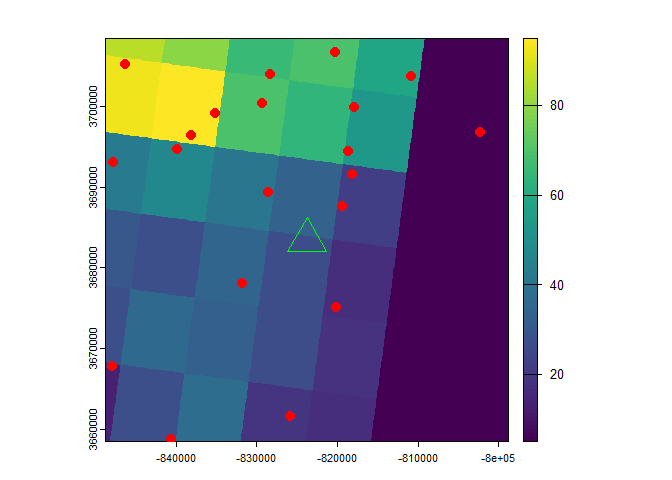
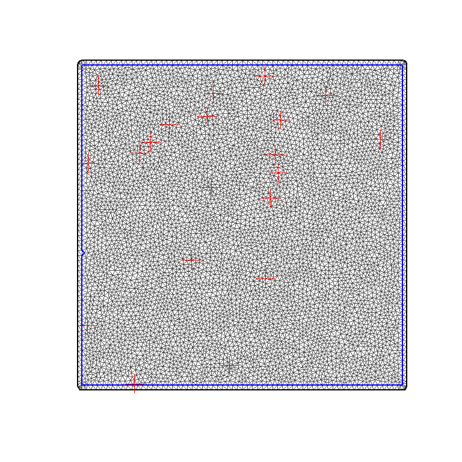

Spatiotemporal Smoothing and other assortative explorations
================
4/19/25

- <a href="#libraries" id="toc-libraries">Libraries</a>
- <a href="#custom-functions" id="toc-custom-functions">Custom
  Functions</a>
- <a href="#create-study-area-grid" id="toc-create-study-area-grid">Create
  Study Area Grid</a>
- <a href="#location-map" id="toc-location-map">Location Map</a>
- <a href="#dispersion-model" id="toc-dispersion-model">Dispersion
  Model</a>
- <a href="#trajectory-model" id="toc-trajectory-model">Trajectory
  Model</a>
- <a href="#plume-map" id="toc-plume-map">Plume Map</a>
- <a href="#get-landcover" id="toc-get-landcover">Get Landcover</a>
- <a href="#get-chicken-density" id="toc-get-chicken-density">Get Chicken
  Density</a>
- <a href="#random-farm-locations" id="toc-random-farm-locations">Random
  Farm Locations</a>
- <a href="#farm-exposure-time" id="toc-farm-exposure-time">Farm Exposure
  Time</a>
- <a href="#spatiotemporal-anaysis"
  id="toc-spatiotemporal-anaysis">SpatioTemporal Anaysis</a>
- <a href="#get-nodes" id="toc-get-nodes">Get Nodes</a>
- <a href="#replicate-timesteps" id="toc-replicate-timesteps">Replicate
  Timesteps</a>
- <a href="#field-index" id="toc-field-index">Field Index</a>
- <a href="#data-stack" id="toc-data-stack">Data Stack</a>
- <a href="#formula" id="toc-formula">Formula</a>
- <a href="#run-model" id="toc-run-model">Run Model</a>
- <a href="#spatial-fields" id="toc-spatial-fields">Spatial Fields</a>
- <a href="#plume-density" id="toc-plume-density">Plume Density</a>

## Libraries

<details open>
<summary>Hide code</summary>

``` r
library(tidyverse)
library(here)
library(ggmap)
library(ggspatial)
library(sf)
library(terra)
library(gt)
library(pals)
library(INLA)

library(splitr)
# devtools::install_github("rich-iannone/splitr")
```

</details>

## Custom Functions

<details open>
<summary>Hide code</summary>

``` r
source(here("R/utilities.R"))
source_dir(here("R"))
```

</details>

## Create Study Area Grid

Choosing an arbitrary geographic point. It will serve as the emission
point source location and be used to define study area extent.

<details open>
<summary>Hide code</summary>

``` r
source_origin <- c(-89.031407, 32.494830)  # Newton County, Mississippi
source_vect <- vect(matrix(source_origin , ncol = 2), type = "points", crs = "EPSG:4326")
timezone_utc <- get_timezone_utc(source_origin)
```

</details>

    Loading required package: lutz

<details open>
<summary>Hide code</summary>

``` r
user_projection <- "+proj=utm +zone=18 +datum=WGS84 +units=m +no_defs"

grid_raster <- create_spatraster_grid(source_origin, user_projection, extent_km = 50) # projected
grid_raster_geo <- create_spatraster_grid_geo(source_origin) # no proj
source_vect <- project(source_vect, user_projection)
```

</details>

## Location Map

Register Stadia Maps API to pull background images.

<details open>
<summary>Hide code</summary>

``` r
map_api <- yaml::read_yaml(here("local", "secrets.yaml"))
register_stadiamaps(key = map_api$stadi_api)
```

</details>

Vicinity around source.

<details open>
<summary>Hide code</summary>

``` r
map_plot <- map_grid(grid_raster)
```

</details>

    ℹ © Stadia Maps © Stamen Design © OpenMapTiles © OpenStreetMap contributors.

    Coordinate system already present. Adding new coordinate system, which will
    replace the existing one.

<details open>
<summary>Hide code</summary>

``` r
map_plot
```

</details>


## Dispersion Model

<details open>
<summary>Hide code</summary>

``` r
sim_dispersion <- create_dispersion_model() %>%
  add_source(
    name = "plume_1", 
    lon = source_origin[1],
    lat = source_origin[2],
    height = 5,
    rate = 100,
    pdiam = 2.5,
    density = 1.5,
    shape_factor = 0.9,
    release_start = ymd_hm("2020-02-16 10:00"),
    release_end = ymd_hm("2020-02-16 10:00") + hours(1)
  ) %>%
  add_dispersion_params(
    start_time = ymd_hm("2020-02-16 10:00"),
    end_time = ymd_hm("2020-02-16 10:00") + hours(24), 
    direction = "forward", 
    met_type = "reanalysis",
    met_dir = here("local/plume"),
    exec_dir = here("local/plume"),
    clean_up= FALSE
  ) %>%
  run_model()

# save
saveRDS(sim_dispersion, here("local/plume/sim_dispersion.rds"))
```

</details>
<details open>
<summary>Hide code</summary>

``` r
# load saved run
sim_dispersion <- readRDS(here("local/plume/sim_dispersion.rds"))

plume_table <- sim_dispersion$disp_df
head(plume_table)
```

</details>

    # A tibble: 6 × 5
      particle_i  hour   lat   lon height
      <chr>      <int> <dbl> <dbl>  <dbl>
    1 00001          1  32.5 -89.1     24
    2 00002          1  32.5 -89.1     88
    3 00003          1  32.5 -89.1      9
    4 00004          1  32.5 -89.1     12
    5 00005          1  32.5 -89.1     11
    6 00006          1  32.5 -89.1     26

## Trajectory Model

<details open>
<summary>Hide code</summary>

``` r
trajectory_model <-
  create_trajectory_model() %>%
  add_trajectory_params(
    traj_name= "traj_2",
    lon = source_origin[1],
    lat = source_origin[2],
    height = 5,
    duration = 24,
    days = c("2020-02-16"),
    daily_hours = c(0, 6, 12, 18),
    model_height = 5000,
    direction = "forward",
    extended_met = TRUE,
    met_type = "reanalysis",
    met_dir = here("local/traj"),
    exec_dir = here("local/traj"),
    clean_up = FALSE
  ) %>%
  run_model()

# save
saveRDS(trajectory_model, here("local/traj/trajectory_model.rds"))
```

</details>
<details open>
<summary>Hide code</summary>

``` r
# load saved run
trajectory_model <- readRDS(here("local/traj/trajectory_model.rds"))

traj_table <- trajectory_model$traj_df
head(traj_table)
```

</details>

    # A tibble: 6 × 21
        run receptor hour_along traj_dt               lat   lon height
      <int>    <int>      <int> <dttm>              <dbl> <dbl>  <dbl>
    1     1        1          0 2020-02-16 00:00:00  32.5 -89.0    5  
    2     1        1          1 2020-02-16 01:00:00  32.6 -89.1    4.4
    3     1        1          2 2020-02-16 02:00:00  32.6 -89.1    4.2
    4     1        1          3 2020-02-16 03:00:00  32.7 -89.1    4.3
    5     1        1          4 2020-02-16 04:00:00  32.7 -89.1    4.9
    6     1        1          5 2020-02-16 05:00:00  32.8 -89.1    5.9
    # ℹ 14 more variables: traj_dt_i <dttm>, lat_i <dbl>, lon_i <dbl>,
    #   height_i <dbl>, pressure <dbl>, theta <dbl>, air_temp <dbl>,
    #   rainfall <dbl>, mixdepth <dbl>, rh <dbl>, sp_humidity <dbl>,
    #   h2o_mixrate <dbl>, terr_msl <dbl>, sun_flux <dbl>

### Plume Plots

<details open>
<summary>Hide code</summary>

``` r
plume_plot <- map_grid2(grid_raster, sim_dispersion$disp_df, group_col = "particle_i", vector_type = "point")
```

</details>

    ℹ © Stadia Maps © Stamen Design © OpenMapTiles © OpenStreetMap contributors.

    Coordinate system already present. Adding new coordinate system, which will
    replace the existing one.

<details open>
<summary>Hide code</summary>

``` r
plume_plot
```

</details>


(Animation doesn’t render in static version of markdown)

<details open>
<summary>Hide code</summary>

``` r
animated_plume <- animate_plume_simple(sim_dispersion$disp_df, group_col = "particle_i", point_size = 0.5)
animated_plume
```

</details>

### Trajectory Plots

<details open>
<summary>Hide code</summary>

``` r
traj_plot <- map_grid2(grid_raster, trajectory_model$traj_df, group_col = "run", 
                       vector_type = "line", line_size = 2)
```

</details>

    ℹ © Stadia Maps © Stamen Design © OpenMapTiles © OpenStreetMap contributors.

    Coordinate system already present. Adding new coordinate system, which will
    replace the existing one.

<details open>
<summary>Hide code</summary>

``` r
traj_plot
```

</details>


## Plume Map

Mapping post emission hour.

<details open>
<summary>Hide code</summary>

``` r
particle_locs <- vect(
  plume_table,
  geom = c("lon","lat"),
  crs = crs(grid_raster_geo)
)

particle_locs <- project(
  x   = particle_locs,  
  y   = grid_raster   
)
```

</details>

Rasterize

<details open>
<summary>Hide code</summary>

``` r
hour_min_r <- rasterize(
  x         = particle_locs,
  y         = grid_raster,
  field     = "hour",
  fun       = function(x, ...) min(x, na.rm = TRUE),
  background = NA,
  touches    = FALSE
)

plot(hour_min_r)

# Smooth to better visualize
radius   <- 500 #m 

w <- terra::focalMat(hour_min_r, d = radius, type = "Gauss")

hour_smooth <- terra::focal(
  x      = hour_min_r,
  w      = w,
  fun    = mean,
  na.rm  = TRUE
)

# save
writeRaster(hour_smooth, here("local/plume/hour_smooth.tif"), overwrite = TRUE)
```

</details>
<details open>
<summary>Hide code</summary>

``` r
hour_smooth <- rast(here("local/plume/hour_smooth.tif"))
plot(hour_smooth)
```

</details>


## Get Landcover

Source: [USGS
MLRC](https://www.usgs.gov/centers/eros/science/data-access)

<details open>
<summary>Hide code</summary>

``` r
nlcd <- rast(here("local/nlcd/Annual_NLCD_LndCov_2023_CU_C1V0.tif")) # NLCD 2023

nlcd <- project(
  x      = nlcd,
  y      = grid_raster,
  method = "near"
)

nlcd <- crop(nlcd, grid_raster)

nlcd <- resample(
  x      = nlcd,
  y      = grid_raster,
  method = "near"
)
```

</details>

### NLCD Classification

<details open>
<summary>Hide code</summary>

``` r
nlcd_table <- read_csv(here("local/nlcd/nlcd_classes.csv"))
```

</details>

    Rows: 16 Columns: 2
    ── Column specification ────────────────────────────────────────────────────────
    Delimiter: ","
    chr (1): Description
    dbl (1): Class

    ℹ Use `spec()` to retrieve the full column specification for this data.
    ℹ Specify the column types or set `show_col_types = FALSE` to quiet this message.

<details open>
<summary>Hide code</summary>

``` r
nlcd_table
```

</details>

    # A tibble: 16 × 2
       Class Description                 
       <dbl> <chr>                       
     1    11 Open Water                  
     2    12 Perennial Ice/Snow          
     3    21 Devloped Open Space         
     4    22 Developed Low Intensity     
     5    23 Developed Medium Intensity  
     6    24 Developed High Intensity    
     7    31 Barren                      
     8    41 DeciduousForest             
     9    42 Evergreen Forest            
    10    43 Mixed Forest                
    11    52 Shrub/Scrub                 
    12    71 Grassland Herbaceous        
    13    81 Pasture/Hay                 
    14    82 Cultivated Crops            
    15    90 Woody Wetlands              
    16    95 Emergent Herbaceous Wetlands

## Get Chicken Density

Source: [Livestock of the
World](https://www.fao.org/livestock-systems/global-distributions/en/)

<details open>
<summary>Hide code</summary>

``` r
chik_dens <- rast(here("assets/GLW4-2020.D-DA.CHK.tif"))

chik_dens <- project(
  x      = chik_dens,
  y      = grid_raster,
  method = "near"
)

chik_dens <- crop(chik_dens, grid_raster)

chik_dens <- resample(
  x      = chik_dens,
  y      = grid_raster,
  method = "near"
)

# density to probability range
farm_prob <- rescale_raster(chik_dens, new_min = 5, new_max = 95)
```

</details>

## Random Farm Locations

Using chicken density to weight random assignment of farm locations.

<details open>
<summary>Hide code</summary>

``` r
farms_n <- 20

set.seed(123)
pts_mat <- spatSample(
  x      = farm_prob,
  size   = farms_n,
  method = "weights",
  na.rm  = TRUE,
  xy     = TRUE
)

farm_locs <- vect(
  as.matrix(pts_mat[, c("x","y")]),
  type = "points",
  crs = crs(farm_prob)
)


plot(farm_prob)
plot(farm_locs, pch = 20, cex=2, col = "red", add=T)
plot(source_vect, pch = 2, cex=4, col= "green", add=T)
```

</details>



## Farm Exposure Time

<details open>
<summary>Hide code</summary>

``` r
farm_locs$exposed_hour <- extract(hour_smooth, farm_locs)[,2]
farm_locs$exposed_hour[is.na(farm_locs$exposed_hour)] = 0

# plume arrival times
range(farm_locs$exposed_hour)
```

</details>

    [1] 0.000000 7.014517

## SpatioTemporal Anaysis

Creating continuous surface from plume estimation \### Mesh

<details open>
<summary>Hide code</summary>

``` r
library(raster)
select <- dplyr::select

grid_extent_poly <- vect(ext(grid_raster), crs = crs(grid_raster))

points_sp <- as(farm_locs, "Spatial")
dom_bnds <-  as(grid_extent_poly, "Spatial")
dom_bnds <- inla.sp2segment(dom_bnds)

set.seed(1976)
mesh.dom <- inla.mesh.2d(boundary = dom_bnds, 
                        loc = points_sp,
                        cutoff = 500, 
                        max.edge = c(500, 5000),
                        offset = c(500,700),
                        min.angle = 30) 

mesh.dom$n
```

</details>

    [1] 6974

<details open>
<summary>Hide code</summary>

``` r
plot(mesh.dom)
plot(points_sp, col="red", cex=3, shape= 1, add=T)
```

</details>



## Get Nodes

<details open>
<summary>Hide code</summary>

``` r
dd = as.data.frame(cbind(mesh.dom$loc[,1], 
                         mesh.dom$loc[,2]))

names(dd) = c("x", "y")

dd$set <- "node"
```

</details>

## Replicate Timesteps

Copy mesh nodes for each timestep

<details open>
<summary>Hide code</summary>

``` r
particle_df <- as.data.frame(particle_locs)
particle_df <- cbind(particle_df , crds(particle_locs)) %>%
  mutate(set = "particle") %>%
  select(-particle_i, -height)

t_steps <- max(ceiling(farm_locs$exposed_hour)) # time in strudy area

comb_data <- data.frame()

for(i in 1:t_steps){
  
  tmp_particle <- particle_df %>%
    filter(hour == i)
  
  tmp_node <- dd %>%
    mutate(hour = i)
  
  comb_data <- rbind(comb_data, tmp_particle, tmp_node)
}
  
dim(comb_data)
```

</details>

    [1] 75952     4

<details open>
<summary>Hide code</summary>

``` r
range(comb_data$hour)
```

</details>

    [1] 1 8

<details open>
<summary>Hide code</summary>

``` r
unique(comb_data$set)
```

</details>

    [1] "particle" "node"    

## Field Index

<details open>
<summary>Hide code</summary>

``` r
k <- length(unique(comb_data$hour))
k # knots
```

</details>

    [1] 8

<details open>
<summary>Hide code</summary>

``` r
locs <- cbind(comb_data$x, comb_data$y)

# Match locations in data frame to locations in mesh
A.mat <- inla.spde.make.A(mesh.dom, 
                        alpha = 2,
                        loc=locs,
                        group = comb_data$hour)

spde0 <- inla.spde2.pcmatern(mesh.dom, alpha = 2,
                            prior.range=c(500, 0.8), # tight
                            prior.sigma=c(1, 0.01),
                            constr = TRUE)

Field.pf <- inla.spde.make.index("Field.pf", 
                               spde0$n.spde,
                               n.group=k)
```

</details>

## Data Stack

<details open>
<summary>Hide code</summary>

``` r
est.lst <- list(c(Field.pf,
                 list(intercept1 = 1)), 
                 list(x_tmp = comb_data[,"x"],
                      hour_step.1 = comb_data[,"hour"],
                      hour_step.2 = comb_data[,"hour"],
                      hour_step.3 = comb_data[,"hour"]))

comb_data$Y <- ifelse(comb_data$set == "particle",1, 0)

est.stk <- inla.stack(data = list(Y = comb_data$Y),
                                 A = list(A.mat, 1), 
                           effects = est.lst,   
                               tag = "est.0")
```

</details>

## Formula

<details open>
<summary>Hide code</summary>

``` r
pcprior_1 <- list(prec = list(prior="pc.prec", param = c(1, 0.01))) 
rho_pc <- list(rho = list(prior = "pc.cor1", param = c(0, 0.9))) 
cont_g <- list(model = "ar1", hyper = rho_pc)

hc1 = list(theta = list(prior = "normal", param = c(0, 10)))
ctr.g = list(model = "iid", hyper = hc1) #sanity check


Formula.1 <- Y ~ -1 + intercept1 +
                      f(Field.pf,
                        model=spde0,
                        group = Field.pf.group,
                        control.group=ctr.g)
```

</details>

## Run Model

<details open>
<summary>Hide code</summary>

``` r
# theta_1 <- c(5.929494, 3.129386, 0.397794)

Model.0 <- inla(Formula.1,
                   #num.threads = 12,
                   data = inla.stack.data(est.stk),
                   family = c("gaussian"), # sanity check
                   verbose = FALSE,
                   control.fixed = list(prec = 1, prec.intercept=1),
                   control.predictor = list(
                                          A = inla.stack.A(est.stk), 
                                          compute = TRUE,
                                          link = 1), 
                   # control.mode = list(restart = TRUE, theta = theta_1),
                   control.inla = list(strategy="adaptive",
                                       int.strategy = "eb"),
                   control.compute=list(dic = FALSE, cpo = FALSE, waic = FALSE)) 

# summary(Model.0)
saveRDS(Model.0, here("local/plume/model0.rds"))
```

</details>

load prior run

<details open>
<summary>Hide code</summary>

``` r
Model.0 <- readRDS(here("local/plume/model0.rds"))
```

</details>

## Spatial Fields

Create a dense point grid

<details open>
<summary>Hide code</summary>

``` r
blank.r <- grid_raster
blank.r[!is.na(blank.r)] <- 0

grid_pnts <- as.points(blank.r)
names(grid_pnts) <- "cell_value"

grid_coords <- grid_pnts %>%
  geom() %>%
  as.data.frame() 
```

</details>

Associate dense points to mesh.

<details open>
<summary>Hide code</summary>

``` r
Ap <- inla.spde.make.A(mesh.dom, 
                       loc = cbind(grid_coords[,"x"], 
                                   grid_coords[,"y"]))
```

</details>

Extract model estimates and rasterize

<details open>
<summary>Hide code</summary>

``` r
mrf_pf <- cbind(Model.0$summary.random$Field.pf$mean, 
                Field.pf$Field.pf.group)

mrf_pf_v <- list()
mrf_pf_v  <- split(mrf_pf[,1], mrf_pf[,2])

rst_list <- vector("list", length(mrf_pf_v))
for(i in 1:length(mrf_pf_v)){
  
  grid_pnts$tmp_attr <- drop(Ap %*% mrf_pf_v[[i]]) 
  
  tmp_r <- rasterize(grid_pnts, 
                     blank.r, 
                    "tmp_attr",
                     background = NA)
  
  names(tmp_r) <- paste0("Hour ", i)
  rst_list[[i]] <- tmp_r
  
}

hour_stack <- rast(rst_list)
hour_stack
```

</details>

## Plume Density

<details open>
<summary>Hide code</summary>

``` r
df <- as.data.frame(hour_stack, xy = TRUE)

df_long <- pivot_longer(
  df,
  cols       = -c(x, y),
  names_to   = "hour_layer",
  values_to  = "hour_value"
)

df_long$hour_value[df_long$hour_value < 0] <- 0

sf_source <- st_as_sf(source_vect)
sf_farms <- st_as_sf(farm_locs)

ggp <- ggplot(df_long, aes(x = x, y = y, fill = hour_value)) +
  geom_raster() +
  facet_wrap(~ hour_layer, ncol = 4) +
  coord_equal(expand = FALSE) +
  #scale_fill_viridis_c(option = "turbo", na.value = "transparent") +
  scale_fill_gradientn(
    colors = rev(pals::cubehelix(30)[1:26]),
    na.value = "white",
    limits = c(0, 1),
    name = "Density"
  ) +
  theme_minimal() +
  theme(
    panel.grid.major = element_blank(),
    panel.grid.minor = element_blank(),
    legend.position = "bottom",
    legend.title = element_text(size = 16, face = "bold"),
    legend.text = element_text(size = 10, face = "bold"),
    legend.key.width = unit(3, "line"),
    legend.key.height = unit(1, "line"),
    strip.text     = element_text(size = 18, face = "bold", color = "gray40"),
    axis.title.x   = element_text(size = 20, face = "bold"),
    axis.title.y   = element_text(size = 20, face = "bold"),
    axis.text.x    = element_text(size = 8, face = "bold"),
    axis.text.y    = element_text(size = 10, face = "bold"),
    plot.title     = element_text(size = 22, face = "bold", hjust = 0.5)
  ) +
  labs(fill = "Hour",
       title = "Relative Particle Density",
      x = "Easting", y = "Northing") +
  geom_sf(
    data = sf_source,
    inherit.aes = FALSE,
    color = "red",
    stroke = 1,
    shape = 2,
    size = 3
  ) +
  geom_sf(
    data = sf_farms,
    inherit.aes = FALSE,
    color = "darkgreen",
    shape = 1,
    size = 2
  )

ggsave(
  filename = "plume_density.png",
  plot = ggp,
  path = here("assets"),
  width = 11,
  height = 8.5,
  units = "in",
  dpi = 100,
  device = "png",
  bg = "white"
)
```

</details>


