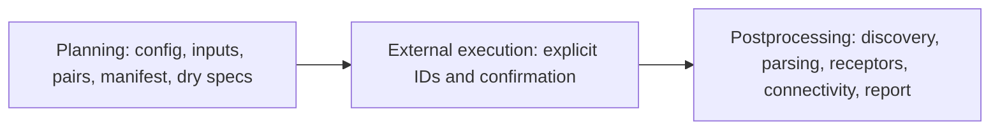

# Targets-based facility exchange pipeline

The workflow uses `targets 1.12.0` to connect planning and safe postprocessing while isolating HYSPLIT execution in a separate script and target store.

Normal execution uses `Rscript scripts/run_facility_exchange_pipeline.R --config config/facility_exchange_demo.yml`. It evaluates `_targets.R`, which contains no call to `run_hysplit_manifest_row()` or any execution target. HYSPLIT requires `_targets_hysplit.R`, nonempty comma-separated `EPIPLUME_RUN_IDS`, the exact confirmation `EPIPLUME_ALLOW_HYSPLIT_EXECUTION=true`, and explicit selection of `execute_selected_hysplit`. Selection defaults to zero runs and unknown or duplicate IDs fail.

The normal graph supports simulated inputs or validated facility/observation CSV files. It dynamically branches at manifest-run level for dry specifications and at eligible-run level for parsing and receptor extraction. Every branch result carries `run_id`; missing, failed, dry-run, invalid, and completed-but-unparsed runs remain in the full inventory. Independent parsing and receptor failures return structured status rather than invoking HYSPLIT or erasing other branches. A zero-success state produces an explicit empty assembly.

The scenario store is `local/facility_exchange_demo/targets`; controlled execution uses a separate `_hysplit` store suffix. Both are under ignored `local/`. Inspect without building with `scripts/inspect_facility_exchange_pipeline.R`. Use `--outdated` to inspect invalidation, `--destroy` to safely destroy the configured normal store before rebuilding, and `--names` for comma-separated normal targets. Only one worker is currently supported.

Configuration, input files, portable parsed objects, and written status/report products are tracked at their natural boundaries. Changing observations invalidates input-dependent planning without changing deterministic facility simulation; exposure changes invalidate receptor/downstream work; a parsed-object change invalidates its run branch and downstream assembly. Status CSV/RDS/JSON records counts, versions, checksums, commit provenance, and output paths. The Quarto report reads those outputs and renders an explicit empty state.

Installed versions recorded for development are: `targets 1.12.0`, `yaml 2.3.10`, `sf 1.0-20`, `terra 1.8-42`, and `splitr 0.4.0.9000`. `tarchetypes` is not used. Normal execution never launches HYSPLIT; missing runs remain explicit; the workflow models atmospheric-tracer connectivity, not infection probability.
